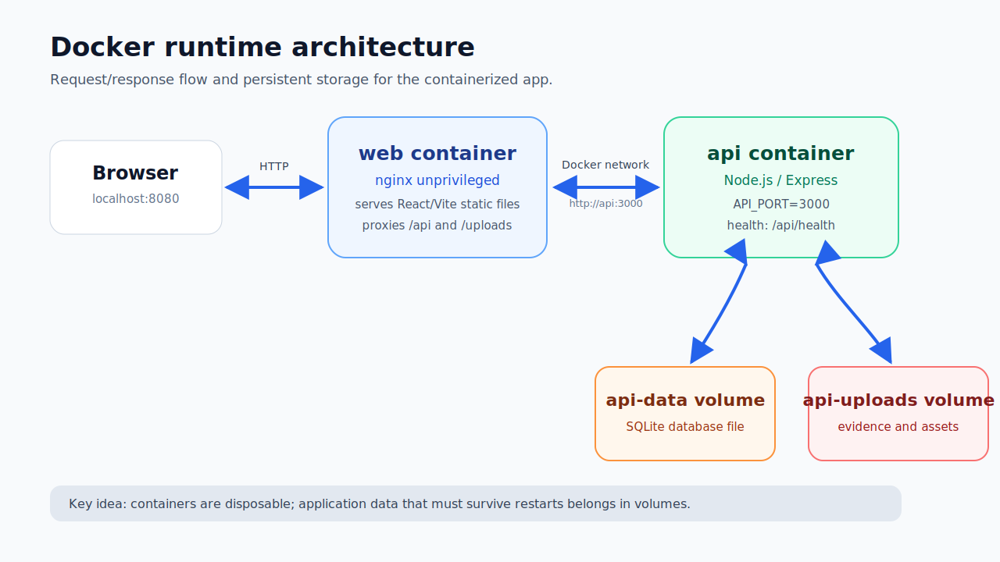
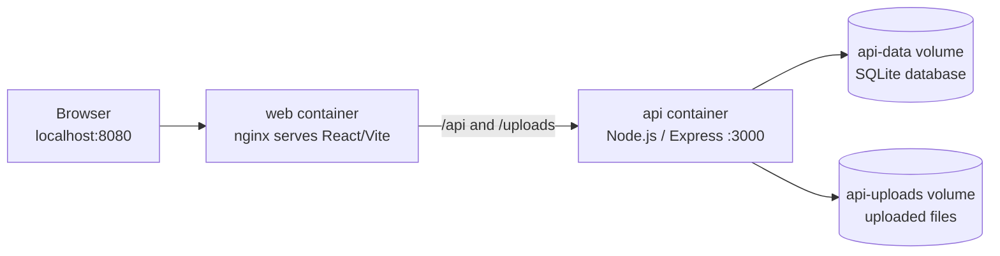

# Docker Hardening Notes

## Purpose

This section documents what I learned while containerising a real application: a Node.js / Express API, a React / Vite frontend, Prisma, SQLite, local uploads and Docker Compose.

The goal was not only to make the app “work in Docker”. The goal was to understand how Docker changes the way an application is built, executed, configured, debugged and hardened.

These notes are written from the perspective of a developer learning AppSec. The focus is practical: improving engineering and security decisions around containerized applications.

---

## Lab application

The practical lab used my AppSec Report Builder project.

The stack included:

- React / Vite frontend,
- Node.js / Express API,
- TypeScript,
- Prisma,
- SQLite,
- local evidence/file uploads,
- Dockerfiles,
- nginx,
- Docker Compose,
- persistent Docker volumes,
- and API health checks.

The final local runtime shape was:






```text
Browser
  |
  v
http://localhost:8080
  |
  v
web container
nginx serves React/Vite static files
  |
  | /api
  | /uploads
  v
api container
Node.js / Express API on port 3000
  |
  v
SQLite database file in Docker volume
```

---

## Files in this section

| File | Purpose |
|---|---|
| `01-container-mental-model.md` | Image, container, layer, volume, network, build context, Dockerfile vs Compose |
| `02-dockerfile-and-multi-stage-builds.md` | Dockerfile instructions, caching, BuildKit secrets, multi-stage builds and runtime images |
| `03-node-api-and-react-nginx-runtime.md` | Practical API image and frontend nginx image decisions |
| `04-compose-volumes-networking-and-storage.md` | Compose services, service DNS, ports, SQLite persistence and uploads persistence |
| `05-runtime-troubleshooting.md` | Real errors from the lab and how they were diagnosed |
| `06-hardening-checklist.md` | Applied hardening decisions and next hardening steps |
| `07-appsec-report-builder-lab.md` | Full practical lab write-up with commands, mistakes, fixes and lessons |

---

## Main learning themes

### 1. Docker is a runtime contract

A Docker image says what exists at runtime:

- files,
- dependencies,
- command,
- user,
- ports,
- environment assumptions,
- writable paths,
- and runtime assets.

That makes Docker important for AppSec. If the image contains too much, the runtime has too much. If the image contains secrets, the runtime may expose them. If the container writes important data only to its filesystem, that data can disappear.

### 2. Build-time and runtime should be separate

A development machine may contain TypeScript, test tools, Storybook, Playwright, Prisma CLI, linters, dev dependencies and source files.

A runtime container should contain only what the application needs to run.

For the API, that means compiled JavaScript, production `node_modules`, generated runtime code, runtime directories and config.

For the frontend, that means static Vite output served by nginx. It does not need Node.js at runtime.

### 3. Build success is not runtime success

During the lab, the API image built successfully, but the container failed at runtime because compiled JavaScript still referenced a `.ts` import from the generated Prisma client.

That gave a useful validation checklist:

```text
Image builds?
Container starts?
Health endpoint responds?
Frontend loads?
Frontend can call API?
Data survives restart?
Logs are clean?
```

### 4. Hardening starts with boring decisions

Container hardening is not only seccomp, AppArmor or advanced runtime controls.

It starts with decisions like:

- multi-stage builds,
- no dev dependencies in runtime,
- no copied secrets,
- frontend served by nginx instead of dev server,
- explicit volumes for mutable data,
- service-to-service networking by Compose service name,
- separate migration step,
- and runtime health checks.

These are simple decisions, but they create a cleaner foundation for deeper hardening later.

---

## Useful commands

Build API image:

```powershell
docker build `
    --file docker/api/Dockerfile `
    --target runtime `
    --tag appsec-report-builder-api:local `
    .
```

Build web image:

```powershell
docker build `
    --file docker/web/Dockerfile `
    --target runtime `
    --tag appsec-report-builder-web:local `
    .
```

Run full stack:

```powershell
docker compose up --build -d
```

Check services:

```powershell
docker compose ps
```

Check API logs:

```powershell
docker compose logs api --tail=80
```

Check frontend:

```powershell
Invoke-WebRequest http://localhost:8080 -UseBasicParsing
```

Check API:

```powershell
Invoke-WebRequest http://localhost:3000/api/health -UseBasicParsing
```

Check API through nginx proxy:

```powershell
Invoke-WebRequest http://localhost:8080/api/health -UseBasicParsing
```

---

## Official references

- Docker multi-stage builds: https://docs.docker.com/build/building/multi-stage/
- Docker build secrets: https://docs.docker.com/build/building/secrets/
- Docker volumes: https://docs.docker.com/engine/storage/volumes/
- Docker Compose: https://docs.docker.com/compose/
- Dockerfile reference: https://docs.docker.com/reference/dockerfile/
