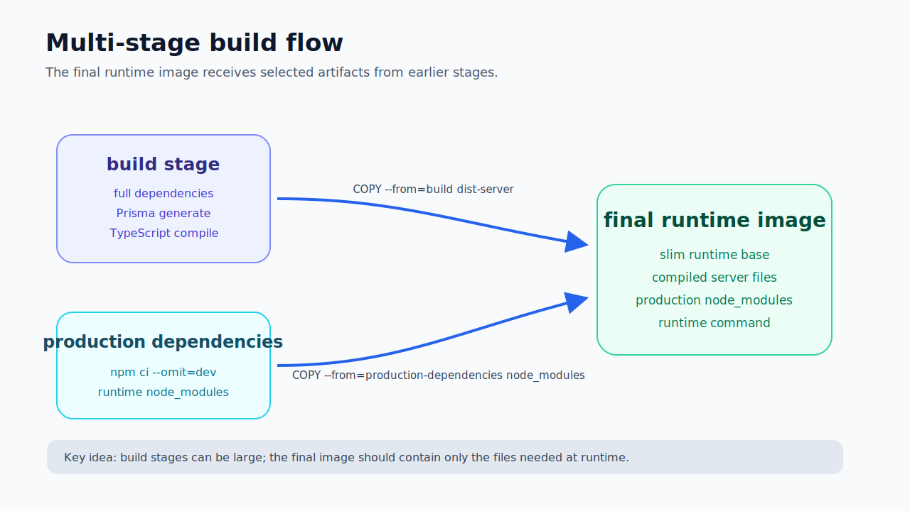
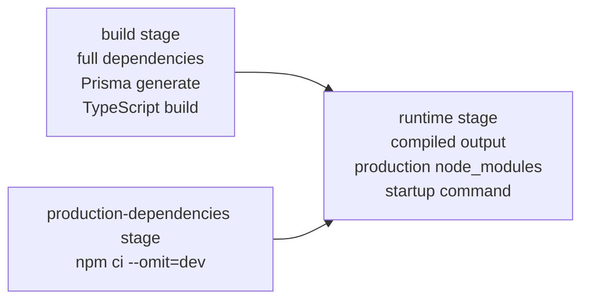

# Dockerfile and Multi-Stage Builds

## Purpose

This note explains the Dockerfile patterns used in the lab, especially multi-stage builds.






The goal is to understand what each stage is for and why the final runtime image should be smaller and cleaner than the build environment.

---

## Dockerfile basics

A Dockerfile is a build recipe for an image.

Example shape:

```dockerfile
FROM node:24-bookworm AS build
WORKDIR /app
COPY package.json package-lock.json ./
RUN npm ci
COPY . .
RUN npm run build

FROM node:24-bookworm-slim AS runtime
WORKDIR /app
COPY --from=build /app/dist-server ./dist-server
CMD ["node", "dist-server/server/index.js"]
```

This is not just a script. It defines what the final image contains.

For AppSec, that matters because every unnecessary file, dependency or tool in the image can increase runtime attack surface.

---

## Important Dockerfile instructions

### `FROM`

Starts a new stage.

```dockerfile
FROM node:24-bookworm AS build
```

Questions:

- Is this image trusted?
- Is it maintained?
- Does runtime need such a large base image?
- Does it run as root by default?

### `WORKDIR`

Sets the working directory.

```dockerfile
WORKDIR /app
```

This keeps paths predictable.

### `COPY`

Copies files from build context into the image.

```dockerfile
COPY package.json package-lock.json ./
```

Security lesson:

```text
COPY should be intentional. Avoid copying secrets, local databases, logs or unnecessary files.
```

### `RUN`

Runs a command during image build.

```dockerfile
RUN npm ci --no-audit --no-fund
```

Important:

```text
RUN happens at build-time, not container runtime.
```

### `CMD`

Defines the default command when the container starts.

```dockerfile
CMD ["node", "dist-server/server/index.js"]
```

Prefer exec form because signal handling is cleaner.

### `USER`

Defines the user running the process.

```dockerfile
USER node
```

Security lesson:

```text
The application should not run as root unless there is a strong reason.
```

### `EXPOSE`

Documents the port the container listens on.

```dockerfile
EXPOSE 3000
```

Important:

```text
EXPOSE does not publish the port to the host. Compose or docker run -p does that.
```

---

## Build cache pattern

Better pattern:

```dockerfile
COPY package.json package-lock.json ./
RUN npm ci --no-audit --no-fund
COPY . .
```

Why?

Dependency install can be cached if package files do not change.

Worse pattern:

```dockerfile
COPY . .
RUN npm ci
```

This invalidates dependency cache whenever any source file changes.

Engineering lesson:

```text
Layer order affects build speed.
```

Security lesson:

```text
Careful COPY patterns reduce accidental exposure and make the build more intentional.
```

---

## `.dockerignore`

`.dockerignore` reduces what is sent to Docker build context.

Useful entries:

```text
node_modules
dist
dist-server
.git
.env
*.log
coverage
uploads
*.db
```

This matters because the build context is what Docker can see.

Security lesson:

```text
Do not let Docker see files it does not need.
```

---

## BuildKit secret mount

In the lab, the Dockerfile used a BuildKit secret mount for `.npmrc`:

```dockerfile
RUN --mount=type=secret,id=npmrc,target=/root/.npmrc,required=false \
    npm ci --no-audit --no-fund
```

Why this matters:

- `.npmrc` may contain registry tokens,
- copying it into the image can leak secrets,
- deleting it later is not enough because image layers may still contain it.

Bad pattern:

```dockerfile
COPY .npmrc ./
RUN npm ci
RUN rm .npmrc
```

Better pattern:

```dockerfile
RUN --mount=type=secret,id=npmrc,target=/root/.npmrc \
    npm ci
```

Security lesson:

```text
Secrets used during build should not become part of image layers.
```

---

## `npm ci` vs `npm install`

For containers and CI, `npm ci` is usually better because it installs from the lockfile and fails if the lockfile is inconsistent.

Development/build install:

```bash
npm ci --no-audit --no-fund
```

Production dependency install:

```bash
npm ci --omit=dev --no-audit --no-fund
```

Security lesson:

```text
Production runtime should not include dev dependencies unless the app genuinely needs them to run.
```

---

## `npm prune --omit=dev` vs `npm ci --omit=dev`

Initial approach:

```bash
npm prune --omit=dev
```

Meaning:

```text
install all dependencies
remove dev dependencies later
```

Better approach:

```bash
npm ci --omit=dev --no-audit --no-fund
```

Meaning:

```text
install production dependencies only
```

This improved build speed and produced a cleaner dependency stage.

Lesson:

```text
Install what runtime needs instead of installing everything and cleaning up afterwards.
```

---

## Multi-stage builds

Each `FROM` starts a new stage.

Example:

```dockerfile
FROM node:24-bookworm AS build
FROM node:24-bookworm AS production-dependencies
FROM node:24-bookworm-slim AS runtime
```

This Dockerfile has three stages.

The final image does not automatically include previous stages.

It only gets files explicitly copied:

```dockerfile
COPY --from=build /app/dist-server ./dist-server
COPY --from=production-dependencies /app/node_modules ./node_modules
```

Main idea:

```text
Use a bigger build environment.
Ship a smaller runtime environment.
```

---

## API multi-stage model

The API image used this concept:

```text
Stage 1: build
  install full dependencies
  generate Prisma client
  compile TypeScript server

Stage 2: production-dependencies
  install only production dependencies

Stage 3: runtime
  copy compiled server output
  copy production node_modules
  run API
```

This separates:

```text
what is needed to build
from
what is needed to run
```

---

## Web multi-stage model

The web image used this concept:

```text
Stage 1: build
  install frontend dependencies
  run Vite production build
  produce static dist output

Stage 2: runtime
  nginx unprivileged image
  copy static files
  serve frontend
  proxy API/uploads
```

Important frontend lesson:

```text
React/Vite needs Node to build, but not necessarily to run.
```

---

## Why one Dockerfile can be enough

One Dockerfile can contain build and runtime stages.

That does not mean build and runtime are the same image.

Benefits:

- one source of truth,
- less drift,
- easier local build,
- Docker cache works across stages,
- final image stays controlled by `COPY --from`.

Separate Dockerfiles may make sense when build and runtime are owned separately or build artifacts are published independently, but for this lab multi-stage Dockerfiles were cleaner.

---

## Security benefits of multi-stage builds

Multi-stage builds help because they reduce what ends up in runtime.

Benefits:

- fewer files,
- fewer tools,
- fewer dev dependencies,
- smaller image,
- cleaner vulnerability scan output,
- less accidental secret/source leakage,
- less tooling available after compromise.

They do not automatically solve:

- root user,
- writable filesystem,
- Linux capabilities,
- seccomp/AppArmor,
- vulnerable production dependencies,
- runtime secrets,
- image signing,
- supply chain provenance.

They are a foundation, not the full hardening story.

---

## Key takeaway

A good multi-stage build is like a factory:

```text
Build stage:
  factory with tools, compilers and full dependencies

Runtime stage:
  final boxed product with only what is needed to run
```

Do not ship the whole factory to production.
