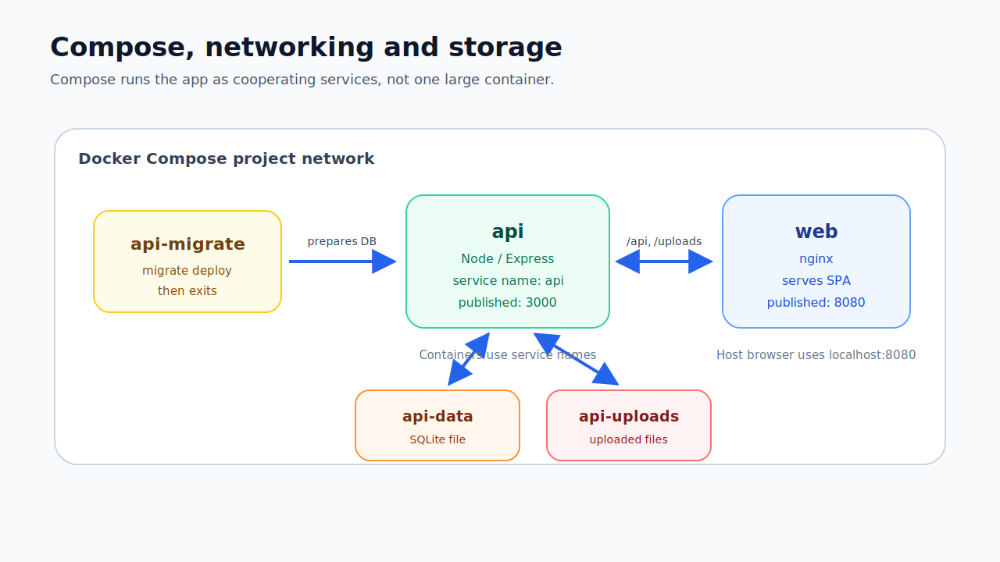
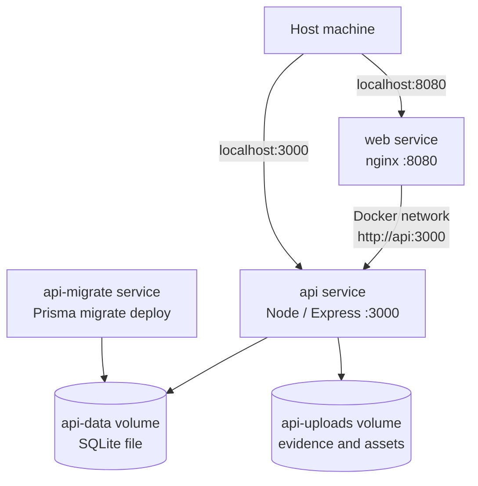

# Docker Compose, Volumes, Networking and Storage

## Purpose

This note documents the Docker Compose part of the lab.

Docker Compose ran the full local stack:






```text
api-migrate
api
web
```

The main learning areas were:

- service dependency order,
- host ports vs container ports,
- service-to-service networking,
- SQLite persistence,
- upload persistence,
- runtime validation.

---

## Dockerfile vs Compose

Dockerfile:

```text
How do I build this image?
```

Docker Compose:

```text
How do I run these services together?
```

In this lab:

```text
docker/api/Dockerfile
  builds API image

docker/web/Dockerfile
  builds web image

docker-compose.yml
  runs API, web and migration services together
```

---

## Services

### `api-migrate`

Purpose:

```text
apply Prisma migrations
prepare SQLite database volume
exit successfully
```

This is a one-off setup job.

It does not need to keep running.

### `api`

Purpose:

```text
run Node.js / Express API
```

It depends on migrations completing successfully.

### `web`

Purpose:

```text
serve React/Vite frontend with nginx
proxy /api and /uploads to API service
```

---

## Why a separate migration service?

The final API runtime image should focus on running the app.

Migrations are setup/deployment work.

They may need:

- Prisma CLI,
- migration files,
- scripts,
- build tooling.

Those do not necessarily belong in the final runtime image.

Better flow:

```text
api-migrate prepares database
api runs application
web serves frontend
```

Security/engineering lesson:

```text
Keep runtime responsibility narrow and make setup steps visible.
```

---

## Compose dependency order

The API used this dependency condition:

```yaml
depends_on:
  api-migrate:
    condition: service_completed_successfully
```

Meaning:

```text
Start API after migrations complete successfully.
```

This reduces the risk of starting the API before the database schema exists.

---

## Ports

Port mapping format:

```text
HOST_PORT:CONTAINER_PORT
```

API:

```yaml
ports:
  - "3000:3000"
```

Meaning:

```text
host localhost:3000 -> API container port 3000
```

Web:

```yaml
ports:
  - "8080:8080"
```

Meaning:

```text
host localhost:8080 -> web container port 8080
```

Important:

```text
EXPOSE documents a port in Dockerfile.
ports publishes it to the host in Compose.
```

Security lesson:

```text
Only publish ports that need host access.
```

For stricter production, the API might stay internal and only web would be published.

---

## Host networking vs Docker networking

From the host:

```text
http://localhost:8080
http://localhost:3000
```

From one container to another:

```text
http://api:3000
```

Inside the web container, `localhost` means the web container itself.

So nginx should proxy to:

```text
http://api:3000
```

not:

```text
http://localhost:3000
```

because the API is a different container.

---

## Service names as DNS names

Docker Compose creates a default network.

Service names become DNS names.

That is why nginx can use:

```nginx
proxy_pass http://api:3000/api/;
```

`api` is the service name.

Security/engineering lesson:

```text
Internal traffic can stay inside the Docker network.
Published host ports should be intentional.
```

---

## SQLite persistence

SQLite is a file-based database.

It does not need a separate database container.

It needs a persistent file location.

Runtime database URL:

```text
DATABASE_URL=file:/data/appsec-report-builder.db
```

Compose volume:

```yaml
volumes:
  - api-data:/data
```

This stores the SQLite database file in a Docker volume.

Without this, deleting/recreating the API container could delete the database file.

Lesson:

```text
For SQLite in Docker, persistence means file persistence.
```

---

## Upload persistence

The application stores uploaded files.

Uploads are mutable data.

Compose volume:

```yaml
volumes:
  - api-uploads:/app/uploads
```

Why:

```text
uploads should survive container recreation
uploads should be separate from image layers
uploads should be an explicit mutable storage path
```

Security note:

```text
Uploads are untrusted content. Storage path, file naming, validation and access rules matter.
```

---

## Named volumes

Compose defined:

```yaml
volumes:
  api-data:
  api-uploads:
```

Useful commands:

```powershell
docker volume ls
```

or:

```powershell
docker volume ls | Select-String appsec
```

Important:

```powershell
docker compose down
```

removes containers and network, but usually keeps named volumes.

Dangerous if you want to keep data:

```powershell
docker compose down -v
```

This removes volumes too.

---

## Environment variables

Compose provided runtime config:

```yaml
environment:
  API_PORT: "3000"
  FRONTEND_ORIGIN: http://localhost:8080
  DATABASE_URL: file:/data/appsec-report-builder.db
  NODE_ENV: production
```

Why this matters:

```text
The same image can run in different environments with different config.
```

Security lesson:

```text
Configuration should be explicit. Secrets should not be baked into images.
```

For this local lab, these values were non-secret.

Real secrets should use secret management.

---

## Request flow

Frontend request:

```text
http://localhost:8080
```

API through proxy:

```text
http://localhost:8080/api/health
```

Full flow:

```text
Browser
  -> localhost:8080
  -> web nginx container
  -> api:3000
  -> API container
  -> SQLite file in api-data volume
```

---

## Validation commands

Start stack:

```powershell
docker compose up --build -d
```

Check services:

```powershell
docker compose ps
```

Expected:

```text
api  Up (healthy)
web  Up
```

Check migration logs:

```powershell
docker compose logs api-migrate
```

Expected:

```text
All migrations have been successfully applied.
```

Check API:

```powershell
Invoke-WebRequest http://localhost:3000/api/health -UseBasicParsing
```

Check web:

```powershell
Invoke-WebRequest http://localhost:8080 -UseBasicParsing
```

Check proxy:

```powershell
Invoke-WebRequest http://localhost:8080/api/health -UseBasicParsing
```

---

## Key takeaway

Docker Compose defines the runtime shape of the app:

```text
which services run
how they start
how they communicate
which ports are exposed
where data persists
which config is injected
```

For AppSec, Compose is part of the security boundary.
