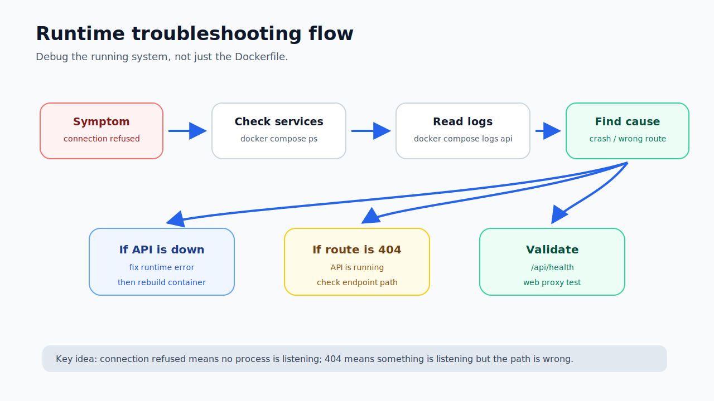
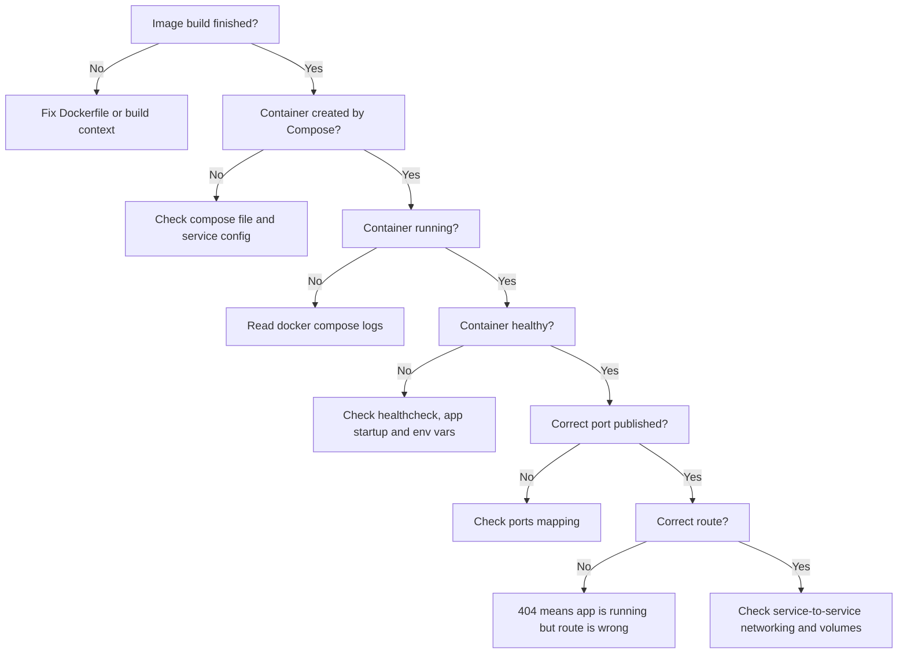

# Docker Runtime Troubleshooting

## Purpose

This note documents real troubleshooting scenarios from the Docker hardening lab.

The goal is to practise reading symptoms correctly instead of guessing.

Docker problems should be separated into categories:

```text
Docker daemon problem
image build problem
container startup problem
application runtime problem
networking problem
routing problem
volume/data problem
configuration problem
```

Each category needs different evidence.

---

## Basic troubleshooting flow

Use this flow before changing code:






```text
1. Did the image build?
2. Did Compose create the container?
3. Is the container running?
4. Is it healthy?
5. What do logs say?
6. Is the port published?
7. Is the route correct?
8. Is the app using expected environment variables?
9. Is the volume mounted?
10. Can services reach each other by service name?
```

Most useful commands:

```powershell
docker compose ps
docker compose logs api --tail=80
docker compose logs web --tail=80
docker compose logs api-migrate --tail=80
```

---

## Problem: Docker daemon unavailable

### Symptom

```text
ERROR: failed to connect to the docker API at npipe:////./pipe/dockerDesktopLinuxEngine
```

### Meaning

Docker CLI could not connect to Docker Desktop Linux Engine.

This is not a Dockerfile problem.

### Check

```powershell
docker info
```

### Fix

Start Docker Desktop.

If needed:

```powershell
wsl --shutdown
```

Then restart Docker Desktop.

### Lesson

```text
Before debugging Dockerfiles, confirm Docker engine is running.
```

---

## Problem: missing file during Docker build

### Symptom

The Docker build failed during Prisma-related build steps because a required script was not available inside the build stage.

### Cause

The script existed locally, but Docker only sees files that are in the build context and copied into the image.

### Fix

Copy the required script:

```dockerfile
COPY scripts/prisma-command.mjs ./scripts/prisma-command.mjs
```

### Lesson

```text
If a build command depends on a file, the Dockerfile must copy it.
Local files do not magically exist inside the image.
```

---

## Problem: TypeScript production build fails in Docker

### Symptom

The Docker build reached:

```text
RUN npm run build:server
```

Then TypeScript failed with Prisma/domain typing issues.

Examples:

```text
Prisma JSON field typing
database string not assignable to domain union
settings date format string not narrowed
readonly orderBy array issue
test JSON value not narrowed
```

### Cause

Docker forced a clean production server build.

That exposed real type and runtime boundary issues.

### Fix categories

The fixes improved the app rather than hiding the problem:

```text
serialize HTTP evidence as plain JSON objects
validate database string values before mapping to domain unions
narrow unknown JSON before reading properties
use Prisma-compatible write data
fix report ordering typing
treat stored settings values as untrusted until validated
```

### Lesson

```text
Docker can expose real application build quality issues.
Do not automatically blame Docker when Docker reveals TypeScript problems.
```

Security lesson:

```text
Database values and JSON fields are runtime data. Validate/narrow them before trusting them as domain types.
```

---

## Problem: image builds but API container crashes

### Symptom

`docker compose ps` showed the web service running, but the API was not up.

API logs showed:

```text
Error [ERR_MODULE_NOT_FOUND]:
Cannot find module '/app/dist-server/generated/prisma/internal/class.ts'
imported from /app/dist-server/generated/prisma/client.js
```

### Wrong first guess

This could look like a Docker copy problem.

But the clue was:

```text
client.js imported class.ts
```

Node was running JavaScript but trying to import a TypeScript file.

### Actual cause

The generated Prisma client was compiled into JavaScript, but relative import extensions still pointed to `.ts`.

### Fix

Add to `tsconfig.server.json`:

```json
{
  "compilerOptions": {
    "rewriteRelativeImportExtensions": true
  }
}
```

### Validation

```powershell
Get-ChildItem .\dist-server\generated\prisma -Recurse -Filter *.js |
    Select-String -Pattern "\.ts'"
```

Expected:

```text
No problematic .ts import results.
```

### Lesson

```text
A successful Docker image build does not prove the emitted JavaScript can run.
Runtime validation is mandatory.
```

---

## Problem: localhost:3000 connection refused

### Symptom

```powershell
Invoke-WebRequest http://localhost:3000/api/health -UseBasicParsing
```

returned:

```text
No connection could be made because the target machine actively refused it.
```

### Meaning

Nothing was listening on `localhost:3000`.

Likely causes:

```text
API container is not running
API container crashed
API port is not published
API listens on a different port
```

### Check

```powershell
docker compose ps
docker compose logs api --tail=80
```

### Lesson

```text
Connection refused is lower-level than application routing.
Check container status before debugging endpoint paths.
```

---

## Problem: route not found

### Symptom

```powershell
Invoke-WebRequest http://localhost:3000/health -UseBasicParsing
```

returned:

```json
{
  "error": {
    "code": "NOT_FOUND",
    "message": "API route not found",
    "details": []
  }
}
```

### Meaning

The API was running, but the route path was wrong.

Correct endpoint:

```text
/api/health
```

### Validation

```powershell
Invoke-WebRequest http://localhost:3000/api/health -UseBasicParsing
```

Expected:

```json
{"status":"ok"}
```

### Lesson

```text
404 means the app is reachable but the route is wrong.
Connection refused means the service is probably not listening.
```

---

## Problem: frontend loads but API proxy fails

### Symptom

Frontend returns 200, but API calls through frontend origin fail.

Check frontend:

```powershell
Invoke-WebRequest http://localhost:8080 -UseBasicParsing
```

Check API direct:

```powershell
Invoke-WebRequest http://localhost:3000/api/health -UseBasicParsing
```

Check API through nginx:

```powershell
Invoke-WebRequest http://localhost:8080/api/health -UseBasicParsing
```

If direct API works but nginx proxy fails, inspect nginx config.

### Common cause

nginx proxy points to `localhost:3000` instead of `api:3000`.

Inside the web container:

```text
localhost = web container
```

Correct proxy target:

```text
http://api:3000
```

### Lesson

```text
Inside Docker Compose, use service names for service-to-service communication.
```

---

## Problem: data disappears after container recreation

### Symptom

Data exists during runtime but disappears after removing/recreating containers.

### Cause

Data was written only inside the container filesystem.

### Fix

Use named volumes:

```yaml
volumes:
  - api-data:/data
  - api-uploads:/app/uploads
```

### Lesson

```text
Containers are disposable. Important mutable data needs volumes or external storage.
```

---

## Problem: slow production dependency stage

### Symptom

Build step was slow:

```bash
npm prune --omit=dev
```

### Cause

The build installed all dependencies first, then removed dev dependencies.

### Fix

Use:

```bash
npm ci --omit=dev --no-audit --no-fund
```

in a separate production dependency stage.

### Lesson

```text
Install only what runtime needs instead of installing everything and cleaning up later.
```

---

## Debugging command reference

Show containers:

```powershell
docker compose ps
```

Show API logs:

```powershell
docker compose logs api --tail=80
```

Show migration logs:

```powershell
docker compose logs api-migrate --tail=80
```

Show web logs:

```powershell
docker compose logs web --tail=80
```

Rebuild and start:

```powershell
docker compose up --build -d
```

Stop stack:

```powershell
docker compose down
```

Dangerous if data matters:

```powershell
docker compose down -v
```

List volumes:

```powershell
docker volume ls
```

---

## Key takeaway

Do not guess.

Start with:

```powershell
docker compose ps
docker compose logs api --tail=80
```

Then test with HTTP requests.

A good Docker troubleshooting flow is evidence-based:

```text
status
logs
ports
routes
health
volumes
network
```
