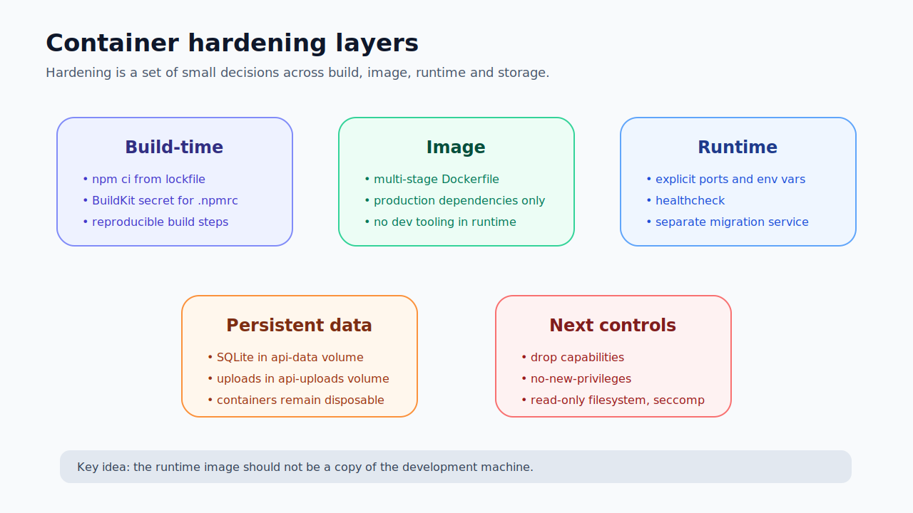
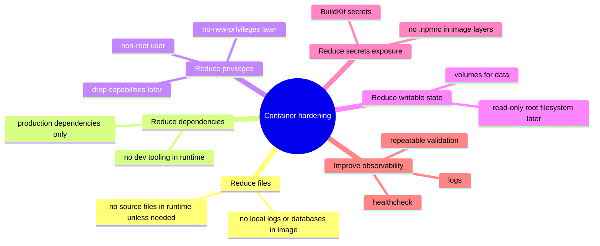

# Docker Security Hardening Checklist

## Purpose

This note turns the practical lab into a container hardening checklist.

It is not a full production benchmark. It is a developer-focused checklist for improving the security posture of a Dockerized Node API, React frontend and Compose stack.

The checklist is split into:

```text
Applied in the lab
Should be added next
Advanced / later
```



---

## Hardening mindset

Container hardening is a series of reductions:




```text
reduce files
reduce dependencies
reduce privileges
reduce writable paths
reduce exposed ports
reduce secrets exposure
reduce runtime tools
reduce unclear configuration
reduce persistence surprises
```

The goal is not an impossible-to-break container.

The goal is to reduce blast radius and make runtime behavior predictable.

---

## Applied in the lab

### 1. Multi-stage builds

Applied:

```text
API image used build, production-dependencies and runtime stages.
Web image used build and nginx runtime stages.
```

Why it matters:

```text
Build tools are not automatically shipped into runtime.
Runtime image is assembled from selected artifacts.
```

Security value:

```text
smaller runtime
fewer unnecessary files
less tooling available after compromise
clearer build/runtime separation
```

---

### 2. Production dependencies only in API runtime

Applied:

```bash
npm ci --omit=dev --no-audit --no-fund
```

Why it matters:

```text
Dev dependencies are not needed to run the API.
```

Security value:

```text
fewer packages
less attack surface
less vulnerability scanning noise
fewer dev tools in runtime
```

---

### 3. Frontend runtime without Node.js

Applied:

```text
Vite built static frontend files.
nginx served the final static files.
```

Security value:

```text
no frontend dev server in runtime
no frontend node_modules in runtime
smaller and simpler image
```

---

### 4. nginx unprivileged image

Applied:

```text
nginxinc/nginx-unprivileged:stable-alpine
```

Security value:

```text
reduced privilege level for frontend runtime
better default than unnecessary root runtime
```

---

### 5. BuildKit secret mount for npm configuration

Applied pattern:

```dockerfile
RUN --mount=type=secret,id=npmrc,target=/root/.npmrc,required=false \
    npm ci --no-audit --no-fund
```

Security value:

```text
reduces risk of leaking npm tokens or private registry config into image layers
```

---

### 6. Persistent SQLite volume

Applied:

```yaml
volumes:
  - api-data:/data
```

with:

```text
DATABASE_URL=file:/data/appsec-report-builder.db
```

Security/engineering value:

```text
explicit data persistence
less accidental data loss
clear separation between image and mutable data
```

---

### 7. Persistent uploads volume

Applied:

```yaml
volumes:
  - api-uploads:/app/uploads
```

Security/engineering value:

```text
explicit storage boundary for uploaded files
```

---

### 8. Separate migration service

Applied:

```text
api-migrate service runs migrations and exits
api service runs the application
```

Value:

```text
clear startup flow
runtime responsibility stays narrower
migration failure is visible
```

---

### 9. Healthcheck and runtime validation

Applied:

```powershell
docker compose ps
docker compose logs api --tail=80
Invoke-WebRequest http://localhost:3000/api/health -UseBasicParsing
Invoke-WebRequest http://localhost:8080/api/health -UseBasicParsing
```

Value:

```text
proves runtime behaviour, not only image build
```

---

## Should be added next

### 1. Non-root API runtime

Goal:

```text
Run API process as a non-root user.
```

Pattern:

```dockerfile
USER node
```

Also ensure ownership:

```dockerfile
COPY --chown=node:node ...
```

Why:

```text
A compromised app process should not have root privileges inside the container.
```

---

### 2. Read-only root filesystem

Goal:

```text
Make container filesystem read-only except required writable paths.
```

Compose idea:

```yaml
read_only: true
tmpfs:
  - /tmp
```

Writable volumes:

```yaml
volumes:
  - api-data:/data
  - api-uploads:/app/uploads
```

Why:

```text
Limits runtime modification of application files.
Forces writable paths to be explicit.
```

---

### 3. Drop Linux capabilities

Goal:

```text
Remove unnecessary Linux capabilities.
```

Compose idea:

```yaml
cap_drop:
  - ALL
```

Then add back only if required.

Why:

```text
Reduces what the process can ask the kernel to do.
```

---

### 4. no-new-privileges

Goal:

```text
Prevent the process from gaining additional privileges.
```

Compose idea:

```yaml
security_opt:
  - no-new-privileges:true
```

Why:

```text
Helps prevent privilege escalation through setuid/setgid binaries.
```

---

### 5. Resource limits

Goal:

```text
Prevent one container from consuming too much CPU or memory.
```

Why:

```text
Reduces impact of runaway processes or basic DoS conditions.
```

---

### 6. Image vulnerability scanning

Goal:

```text
Scan final runtime images, not only source dependencies.
```

Possible tools:

```text
Docker Scout
Trivy
Grype
GitHub Dependabot alerts
```

Important:

```text
Scan the runtime image because that is what gets deployed.
```

---

### 7. SBOM generation

Goal:

```text
Generate a Software Bill of Materials for images/dependencies.
```

Formats:

```text
CycloneDX
SPDX
```

Lesson:

```text
An SBOM is an inventory, not automatic proof of safety.
```

---

### 8. Runtime secrets management

Avoid:

```dockerfile
ENV API_KEY=...
```

Avoid committed secrets in Compose:

```yaml
environment:
  DATABASE_PASSWORD: secret
```

Better:

```text
platform secrets
Docker secrets
CI/CD secret injection
secret manager
mounted secret files
```

---

### 9. Upload security controls

For uploads, review:

```text
file size limits
allowed file types
content validation
randomized storage names
path traversal protection
private storage where possible
safe download headers
malware scanning if required
no execution from upload directories
```

Uploads are untrusted input stored on disk.

---

## Advanced / later

### Seccomp

Seccomp filters Linux syscalls.

Goal:

```text
Limit which syscalls a container process can make.
```

Why:

```text
Reduces kernel attack surface available to a compromised process.
```

---

### AppArmor

AppArmor can restrict what a process can access.

Goal:

```text
Limit file access, capabilities and process behaviour further.
```

---

### Rootless Docker / rootless containers

Goal:

```text
Reduce impact of Docker daemon or container privilege issues.
```

---

### Signed images and provenance

Goal:

```text
Prove where an image came from and how it was built.
```

Related concepts:

```text
image signing
build provenance
SLSA
attestations
```

---

## Practical checklist

### Dockerfile

```text
[ ] Use multi-stage builds.
[ ] Copy package files before source files.
[ ] Use npm ci, not npm install, in builds.
[ ] Use npm ci --omit=dev for production dependencies.
[ ] Do not copy .npmrc or secrets into image.
[ ] Use BuildKit secret mounts for build secrets.
[ ] Keep final runtime image focused.
[ ] Do not run frontend dev server in production.
[ ] Use non-root runtime user where practical.
[ ] Set correct file ownership for non-root runtime.
[ ] Do not include unnecessary source/test/dev files.
```

### Compose

```text
[ ] Define services clearly.
[ ] Use service names for internal networking.
[ ] Publish only required host ports.
[ ] Use volumes for persistent mutable data.
[ ] Avoid storing secrets in committed Compose files.
[ ] Separate migration/setup job if useful.
[ ] Add health checks.
[ ] Consider read_only filesystem.
[ ] Consider cap_drop: ALL.
[ ] Consider no-new-privileges.
[ ] Add resource limits where supported.
```

### Runtime validation

```text
[ ] docker compose ps shows expected services.
[ ] API is Up/healthy.
[ ] Web is Up.
[ ] Migration service completed successfully.
[ ] API logs show startup success.
[ ] Web returns index.html.
[ ] API health endpoint returns 200.
[ ] API works through nginx proxy.
[ ] Data persists after container recreation.
[ ] Uploads persist after container recreation.
```

---

## Key takeaway

The first hardening step is discipline:

```text
Do not ship the build environment.
Do not ship secrets.
Do not ship dev dependencies.
Do not store data inside disposable containers.
Do not guess when debugging.
Do not trust build success without runtime validation.
```

Advanced controls are easier to apply after this foundation is clean.
