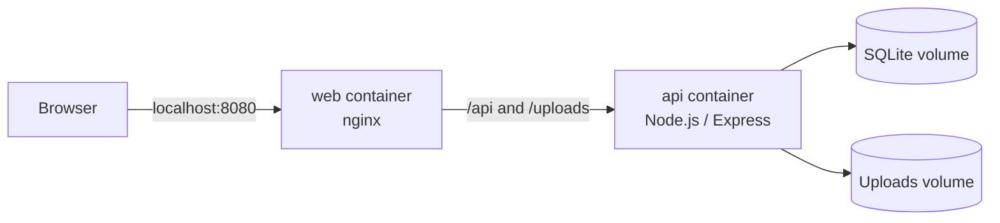

# Practical Lab: Dockerizing and Hardening AppSec Report Builder

## Goal

The goal of this lab was to containerize a real application in a production-oriented way and learn practical Docker hardening from the process.

The application was not a small tutorial app. It had a real stack:




```text
React / Vite frontend
Node.js / Express API
TypeScript
Prisma
SQLite
local file uploads
API routes
frontend routing
Dockerfiles
nginx
Docker Compose
```

The goal was not only:

```text
make it run in Docker
```

The better goal was:

```text
build cleaner runtime images
separate build-time and runtime concerns
avoid shipping unnecessary dependencies
persist local data correctly
debug real container failures
understand security impact of Docker decisions
```

---

## What this lab changed in my thinking

This lab changed how I think about Docker.

Before this, Docker could be seen mostly as a way to package and run an application.

After this lab, Docker is easier to understand as a runtime contract and a security boundary.

A Docker image says:

```text
these files exist
these dependencies exist
this user runs the process
this command starts the app
this port is expected
these environment variables matter
this data path must be writable
```

That makes Docker relevant to AppSec.

If the image contains too much, the runtime has too much.

If secrets are copied during build, they may leak into image layers.

If data is written only inside the container filesystem, it can disappear.

If the frontend relies on a development proxy, production can fail.

If the API works locally but not inside a container, the container may reveal hidden runtime assumptions.

The biggest lesson:

```text
Docker is not only about running the app.
It is about defining what the app is allowed to have at runtime.
```

---

## Application context

The lab application was AppSec Report Builder.

It stores and manages:

```text
companies
assessments
threats
evidence
reports
settings
uploaded files
```

The backend uses Prisma and SQLite.

The frontend uses React and Vite.

The application is local-first, so SQLite and local uploads are important.

In Docker, this means:

```text
SQLite database must live in a volume.
Uploads must live in a volume.
Containers should be disposable.
Images should not contain runtime data.
```

---

## Final architecture

The final local runtime looked like this:

```text
Browser
  |
  v
http://localhost:8080
  |
  v
web container
nginx serves React/Vite static files
  |
  | /api
  | /uploads
  v
api container
Node.js / Express API on port 3000
  |
  v
SQLite database file in api-data volume
```

Services:

```text
api-migrate
api
web
```

Volumes:

```text
api-data
api-uploads
```

Published ports:

```text
localhost:8080 -> web container
localhost:3000 -> api container
```

Internal Docker networking:

```text
web -> api:3000
```

---

## What was built

### API image

A production API image was built with a multi-stage Dockerfile.

Conceptual stages:

```text
build
production-dependencies
runtime
```

Build stage:

```text
npm ci
Prisma client generation
TypeScript server build
```

Production dependency stage:

```text
npm ci --omit=dev
```

Runtime stage:

```text
compiled API
production node_modules
runtime directories
startup command
healthcheck
```

This was better than shipping the full development environment.

---

### Web image

A production web image was built with:

```text
Node build stage
nginx runtime stage
```

Build stage:

```text
npm ci
Vite production build
```

Runtime stage:

```text
serve static frontend files with nginx
proxy /api
proxy /uploads
SPA fallback
```

Important lesson:

```text
React/Vite needs Node to build.
It does not need Node to run in production.
```

---

### Docker Compose stack

Compose connected everything:

```text
api-migrate prepares database
api runs backend
web serves frontend and proxies backend paths
```

This created a local environment closer to a deployment-style setup.

---

## API Docker build

Build command:

```powershell
docker build `
    --file docker/api/Dockerfile `
    --target runtime `
    --tag appsec-report-builder-api:local `
    .
```

Explanation:

```text
--file
  choose API Dockerfile

--target runtime
  build final runtime stage

--tag
  name the image

.
  use current directory as build context
```

The API build forced the project to prove it could compile in a clean container environment.

That exposed issues that needed proper fixes rather than Docker hacks.

---

## Web Docker build

Build command:

```powershell
docker build `
    --file docker/web/Dockerfile `
    --target runtime `
    --tag appsec-report-builder-web:local `
    .
```

The web build produced a static frontend runtime served by nginx.

Single-container test:

```powershell
docker run `
    --rm `
    --name appsec-report-builder-web-test `
    -p 8080:8080 `
    appsec-report-builder-web:local
```

Validation:

```powershell
Invoke-WebRequest http://localhost:8080 -UseBasicParsing
```

Expected:

```text
200 OK
```

---

## Compose run

Start full stack:

```powershell
docker compose up --build -d
```

Check services:

```powershell
docker compose ps
```

Expected:

```text
api  Up (healthy)
web  Up
```

Check API logs:

```powershell
docker compose logs api --tail=80
```

Expected:

```text
AppSec API running at http://localhost:3000
```

Check migration logs:

```powershell
docker compose logs api-migrate
```

Expected:

```text
All migrations have been successfully applied.
```

---

## Final validation

Frontend:

```powershell
Invoke-WebRequest http://localhost:8080 -UseBasicParsing
```

Expected:

```text
200 OK
```

API direct:

```powershell
Invoke-WebRequest http://localhost:3000/api/health -UseBasicParsing
```

Expected:

```json
{"status":"ok"}
```

API through nginx proxy:

```powershell
Invoke-WebRequest http://localhost:8080/api/health -UseBasicParsing
```

Expected:

```json
{"status":"ok"}
```

This confirmed:

```text
web container works
API container works
nginx proxy works
Docker network works
health endpoint works
Compose stack works
```

---

## Problem 1: missing Prisma command script during build

### Symptom

The Docker build failed during Prisma-related build steps because a script required by the package command was not available inside the container build stage.

### Cause

The script existed locally but had not been copied into the Docker image build stage.

### Fix

Copy the required script into the image:

```dockerfile
COPY scripts/prisma-command.mjs ./scripts/prisma-command.mjs
```

### Lesson

Docker builds are explicit.

A file existing locally does not mean it exists inside the image.

If a build command depends on a file, the Dockerfile must copy it.

---

## Problem 2: server production build exposed TypeScript issues

### Symptom

The API Docker build reached:

```text
RUN npm run build:server
```

Then TypeScript failed with Prisma/domain typing issues.

Examples included:

```text
Prisma JSON field typing
activity action string vs domain union
settings date format string vs allowed values
evidence request/response JSON narrowing
report ordering type mismatch
```

### Cause

The production server build was stricter and cleaner than the normal development flow.

It exposed real type and runtime boundary problems.

### Fix

The fixes improved the application code:

```text
serialize HTTP evidence as plain JSON
validate database strings before mapping to domain types
narrow unknown JSON in tests
use Prisma-compatible write data
handle settings values as untrusted until validated
fix repository ordering types
```

### Security lesson

This was not only a TypeScript issue.

It was a data trust boundary issue.

Values read from a database or JSON field should not automatically be treated as valid domain objects.

A safer pattern is:

```text
read raw data
validate/narrow it
map to domain type
```

This fits AppSec thinking because stored data can become corrupted, migrated incorrectly or changed unexpectedly.

---

## Problem 3: slow production dependency stage

### Symptom

The Docker build worked, but this step was slow:

```bash
npm prune --omit=dev
```

### Cause

The build installed all dependencies first and then removed development dependencies.

### Fix

Use a separate production dependency stage:

```bash
npm ci --omit=dev --no-audit --no-fund
```

### Lesson

It is better to install only what runtime needs than to install everything and clean up later.

Security angle:

```text
A runtime image with fewer dependencies has a smaller attack surface and cleaner vulnerability scan output.
```

---

## Problem 4: API image built but container crashed

### Symptom

Compose showed only the web container running.

The API logs showed:

```text
Error [ERR_MODULE_NOT_FOUND]:
Cannot find module '/app/dist-server/generated/prisma/internal/class.ts'
imported from /app/dist-server/generated/prisma/client.js
```

### Cause

The compiled JavaScript still referenced a `.ts` import from the generated Prisma client.

Node was executing JavaScript and could not import that TypeScript path.

### Fix

Add this to `tsconfig.server.json`:

```json
{
  "compilerOptions": {
    "rewriteRelativeImportExtensions": true
  }
}
```

Then rebuild.

### Validation

```powershell
Get-ChildItem .\dist-server\generated\prisma -Recurse -Filter *.js |
    Select-String -Pattern "\.ts'"
```

Expected:

```text
No problematic .ts import results.
```

### Lesson

This was one of the strongest lessons from the lab:

```text
Build success is not runtime success.
```

The image can build correctly and still fail when Node actually executes the output.

Runtime validation is required.

---

## Problem 5: connection refused

### Symptom

```powershell
Invoke-WebRequest http://localhost:3000/api/health -UseBasicParsing
```

returned:

```text
No connection could be made because the target machine actively refused it.
```

### Cause

The API container was not running because it had crashed.

### Debugging

```powershell
docker compose ps
docker compose logs api --tail=80
```

### Lesson

Connection refused usually means:

```text
no process is listening on that host/port
```

It is different from a 404 route error.

---

## Problem 6: wrong health endpoint path

### Symptom

```powershell
Invoke-WebRequest http://localhost:3000/health -UseBasicParsing
```

returned:

```json
{
  "error": {
    "code": "NOT_FOUND",
    "message": "API route not found",
    "details": []
  }
}
```

### Cause

The API was running, but the route path was wrong.

Correct endpoint:

```text
/api/health
```

### Lesson

Different failures mean different layers:

```text
connection refused:
  container/service not listening

404 route not found:
  app is reachable, route path is wrong

200 OK:
  service and route work
```

---

## Problem 7: frontend dev proxy is not production proxy

### Context

The Vite dev server can proxy API requests in development.

But after the frontend is built into static files, there is no Vite dev server.

### Fix

nginx needed explicit proxy rules:

```text
/api     -> api:3000
/uploads -> api:3000
```

### Lesson

Frontend development behavior is not production behavior.

A production frontend runtime needs real routing/proxy configuration.

---

## Security decisions applied

The lab applied several practical hardening decisions:

```text
multi-stage Docker builds
build stage separated from runtime stage
production dependencies only in API runtime
frontend runtime without Node.js
nginx unprivileged image
BuildKit secret mount for npm config
persistent SQLite volume
persistent uploads volume
separate migration service
explicit runtime environment variables
API healthcheck
runtime validation through logs and HTTP checks
```

These are not advanced kernel-level controls yet, but they are important foundations.

---

## What this lab did not fully cover yet

Next areas:

```text
read-only root filesystem
tmpfs for temporary writable paths
drop Linux capabilities
no-new-privileges
seccomp profile
AppArmor profile
resource limits
image vulnerability scanning
SBOM generation
runtime secrets management
signed images/provenance
CI/CD image build and scan pipeline
```

Docker hardening is layered.

The first layer is clean image/runtime design.

The next layer is runtime restriction.

Then comes supply chain assurance.

---

## Commands used in the lab

Build API image:

```powershell
docker build `
    --file docker/api/Dockerfile `
    --target runtime `
    --tag appsec-report-builder-api:local `
    .
```

Build web image:

```powershell
docker build `
    --file docker/web/Dockerfile `
    --target runtime `
    --tag appsec-report-builder-web:local `
    .
```

Start full stack:

```powershell
docker compose up --build -d
```

Check services:

```powershell
docker compose ps
```

Check API logs:

```powershell
docker compose logs api --tail=80
```

Check migration logs:

```powershell
docker compose logs api-migrate
```

Check frontend:

```powershell
Invoke-WebRequest http://localhost:8080 -UseBasicParsing
```

Check API direct:

```powershell
Invoke-WebRequest http://localhost:3000/api/health -UseBasicParsing
```

Check API through nginx proxy:

```powershell
Invoke-WebRequest http://localhost:8080/api/health -UseBasicParsing
```

Stop stack:

```powershell
docker compose down
```

List volumes:

```powershell
docker volume ls
```

---

## Final takeaways

### 1. Docker forced a cleaner production build

Local development can hide assumptions.

Docker build and runtime made those assumptions visible.

### 2. Runtime images should not look like development machines

The API runtime should run the compiled app with production dependencies.

The web runtime should serve static files, not run Vite dev server.

### 3. Persistent data must be explicit

SQLite and uploads need volumes.

Containers are disposable.

### 4. Build secrets should not enter image layers

Temporary build secret mounts are safer than copying `.npmrc`.

### 5. Logs are not optional

The fastest path to the root cause was:

```powershell
docker compose ps
docker compose logs api --tail=80
```

### 6. Different failures mean different layers

```text
Docker daemon error:
  Docker engine problem

Build error:
  Dockerfile/build context/app build problem

Connection refused:
  service not listening or crashed

404:
  route path wrong

200:
  route works
```

### 7. Hardening starts before advanced controls

Before seccomp, AppArmor and capabilities, the basics must be correct:

```text
smaller runtime images
no dev dependencies
no copied secrets
non-dev frontend runtime
persistent volumes
explicit config
runtime validation
```

---

## Personal learning reflection

As a developer learning AppSec, this lab was valuable because it connected normal engineering work with security thinking.

Docker was not a separate DevOps topic here.

It affected:

```text
dependency exposure
secret handling
runtime permissions
file persistence
service boundaries
debugging evidence
deployment assumptions
attack surface
```

The practical lesson:

```text
Secure containerization starts with understanding exactly what the application needs to build, what it needs to run, and what it should not have at runtime.
```

That mindset carries into future Docker and container security work.
