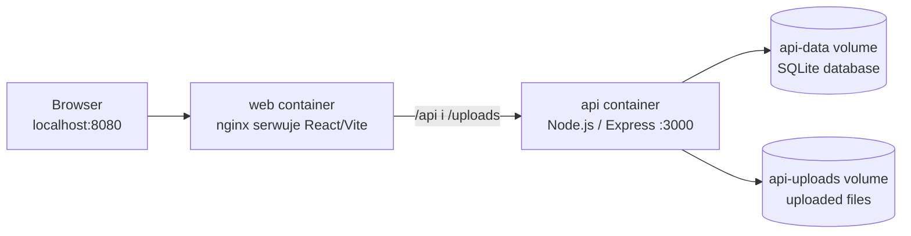

# Notatki: Docker Hardening

## Cel

Ten moduł opisuje praktyczne wnioski z konteneryzacji realnej aplikacji: API Node.js / Express, frontend React / Vite, Prisma, SQLite, lokalne uploady i Docker Compose.

Celem nie było tylko uruchomienie aplikacji w Dockerze. Celem było zrozumienie, jak Docker zmienia build, runtime, konfigurację, debugowanie i hardening aplikacji.

Notatki są pisane z perspektywy developera uczącego się AppSec. Chodzi o lepsze decyzje inżynierskie i bezpieczeństwa, nie o deklarowanie zmiany roli.

---

## Aplikacja labowa

Praktyczny lab bazował na projekcie AppSec Report Builder.

Stack obejmował:

- frontend React / Vite,
- API Node.js / Express,
- TypeScript,
- Prisma,
- SQLite,
- lokalne uploady dowodów/plików,
- Dockerfile dla API i frontendu,
- nginx,
- Docker Compose,
- trwałe wolumeny Dockera,
- health check API.

Docelowy lokalny runtime wyglądał tak:




```text
Browser
  |
  v
http://localhost:8080
  |
  v
web container
nginx serwuje statyczny build React/Vite
  |
  | /api
  | /uploads
  v
api container
Node.js / Express API na porcie 3000
  |
  v
plik SQLite w wolumenie Dockera
```

---

## Pliki w tym module

| Plik | Rola |
|---|---|
| `01-container-mental-model.md` | Image, container, layer, volume, network, build context, Dockerfile vs Compose |
| `02-dockerfile-and-multi-stage-builds.md` | Instrukcje Dockerfile, cache, sekrety BuildKit, multi-stage builds i runtime images |
| `03-node-api-and-react-nginx-runtime.md` | Decyzje dla obrazu API i frontendu serwowanego przez nginx |
| `04-compose-volumes-networking-and-storage.md` | Compose services, DNS usług, porty, trwałość SQLite i uploadów |
| `05-runtime-troubleshooting.md` | Realne błędy z laba i sposób ich diagnozowania |
| `06-hardening-checklist.md` | Zastosowane decyzje hardeningowe i kolejne kroki |
| `07-appsec-report-builder-lab.md` | Praktyczny opis laba: komendy, błędy, poprawki i wnioski |

---

## Główne tematy

### 1. Docker jako kontrakt runtime

Obraz Dockera mówi, co istnieje w runtime:

- pliki,
- zależności,
- komenda startowa,
- użytkownik procesu,
- porty,
- założenia środowiskowe,
- ścieżki zapisu,
- assety runtime.

Dla AppSec ma to znaczenie. Jeżeli obraz zawiera zbyt dużo, runtime ma zbyt dużo. Jeżeli obraz zawiera sekrety, runtime może je ujawnić. Jeżeli kontener zapisuje ważne dane tylko w swoim filesystemie, dane mogą zniknąć przy odtworzeniu kontenera.

### 2. Build-time i runtime powinny być rozdzielone

Maszyna developerska może mieć TypeScript, narzędzia testowe, Storybook, Playwright, Prisma CLI, lintery, dev dependencies i źródła.

Kontener runtime powinien mieć tylko to, czego aplikacja potrzebuje do działania.

Dla API oznacza to skompilowany JavaScript, produkcyjne `node_modules`, wygenerowany kod runtime, katalogi runtime i konfigurację.

Dla frontendu oznacza to statyczny output Vite serwowany przez nginx. Node.js nie jest potrzebny w runtime frontendu.

### 3. Build success to nie runtime success

W labie obraz API zbudował się poprawnie, ale kontener padał w runtime, bo skompilowany JavaScript nadal odwoływał się do importu `.ts` z wygenerowanego klienta Prisma.

Praktyczna checklista walidacji:

```text
Image builds?
Container starts?
Health endpoint responds?
Frontend loads?
Frontend can call API?
Data survives restart?
Logs are clean?
```

### 4. Hardening zaczyna się od prostych decyzji

Container hardening to nie tylko seccomp, AppArmor albo zaawansowane kontrole runtime.

Zaczyna się od decyzji takich jak:

- multi-stage builds,
- brak dev dependencies w runtime,
- brak kopiowanych sekretów,
- frontend serwowany przez nginx zamiast dev servera,
- jawne wolumeny dla mutable data,
- komunikacja service-to-service po nazwie usługi Compose,
- osobny krok migracji,
- runtime health checks.

To proste decyzje, ale budują czystą podstawę pod dalszy hardening.

---

## Przydatne komendy

Build obrazu API:

```powershell
docker build `
    --file docker/api/Dockerfile `
    --target runtime `
    --tag appsec-report-builder-api:local `
    .
```

Build obrazu web:

```powershell
docker build `
    --file docker/web/Dockerfile `
    --target runtime `
    --tag appsec-report-builder-web:local `
    .
```

Uruchomienie stacka:

```powershell
docker compose up --build -d
```

Sprawdzenie usług:

```powershell
docker compose ps
```

Logi API:

```powershell
docker compose logs api --tail=80
```

Sprawdzenie frontendu:

```powershell
Invoke-WebRequest http://localhost:8080 -UseBasicParsing
```

Sprawdzenie API:

```powershell
Invoke-WebRequest http://localhost:3000/api/health -UseBasicParsing
```

Sprawdzenie API przez proxy nginx:

```powershell
Invoke-WebRequest http://localhost:8080/api/health -UseBasicParsing
```

---

## Oficjalne źródła

- Docker multi-stage builds: https://docs.docker.com/build/building/multi-stage/
- Docker build secrets: https://docs.docker.com/build/building/secrets/
- Docker volumes: https://docs.docker.com/engine/storage/volumes/
- Docker Compose: https://docs.docker.com/compose/
- Dockerfile reference: https://docs.docker.com/reference/dockerfile/
