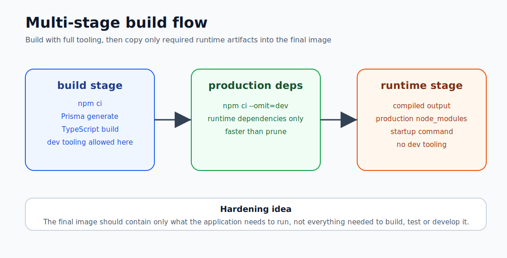
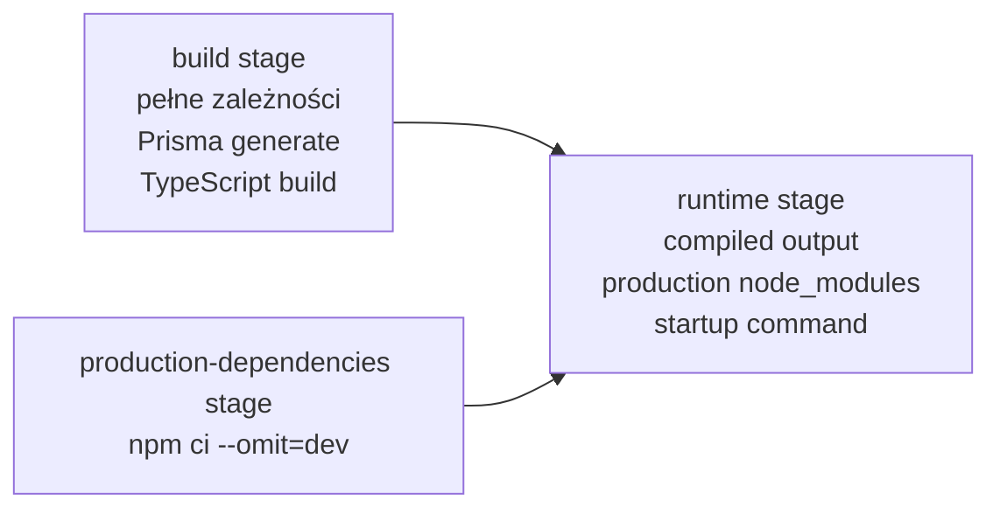

# Dockerfile i Multi-Stage Builds

## Cel

Ta notatka wyjaśnia wzorce Dockerfile użyte w labie, szczególnie multi-stage builds.





Celem jest zrozumienie roli każdego stage i tego, dlaczego finalny runtime image powinien być mniejszy i czystszy niż środowisko builda.

---

## Podstawy Dockerfile

Dockerfile to przepis budowania obrazu.

```dockerfile
FROM node:24-bookworm AS build
WORKDIR /app
COPY package.json package-lock.json ./
RUN npm ci
COPY . .
RUN npm run build

FROM node:24-bookworm-slim AS runtime
WORKDIR /app
COPY --from=build /app/dist-server ./dist-server
CMD ["node", "dist-server/server/index.js"]
```

To nie jest tylko skrypt. Dockerfile definiuje, co finalny obraz zawiera.

Dla AppSec ma to znaczenie, bo każdy zbędny plik, pakiet albo tool w obrazie zwiększa powierzchnię runtime.

---

## Ważne instrukcje

### `FROM`

Rozpoczyna nowy stage.

```dockerfile
FROM node:24-bookworm AS build
```

Pytania:

- Czy obraz jest zaufany?
- Czy jest utrzymywany?
- Czy runtime potrzebuje tak dużego base image?
- Czy domyślnie działa jako root?

### `WORKDIR`

Ustawia katalog roboczy.

```dockerfile
WORKDIR /app
```

### `COPY`

Kopiuje pliki z build context do obrazu.

```dockerfile
COPY package.json package-lock.json ./
```

```text
COPY powinno być intencjonalne. Nie kopiuj sekretów, lokalnych baz, logów ani zbędnych plików.
```

### `RUN`

Uruchamia komendę podczas builda obrazu.

```dockerfile
RUN npm ci --no-audit --no-fund
```

```text
RUN wykonuje się w build-time, nie w runtime kontenera.
```

### `CMD`

Definiuje domyślną komendę startową.

```dockerfile
CMD ["node", "dist-server/server/index.js"]
```

Preferuj exec form, bo obsługa sygnałów jest czystsza.

### `USER`

Definiuje użytkownika procesu.

```dockerfile
USER node
```

```text
Aplikacja nie powinna działać jako root, chyba że istnieje mocny powód.
```

### `EXPOSE`

Dokumentuje port, na którym kontener nasłuchuje.

```dockerfile
EXPOSE 3000
```

```text
EXPOSE nie publikuje portu na hoście. Robi to Compose albo docker run -p.
```

---

## Wzorzec cache builda

Lepszy wzorzec:

```dockerfile
COPY package.json package-lock.json ./
RUN npm ci --no-audit --no-fund
COPY . .
```

Instalacja zależności może zostać zcache'owana, jeżeli pliki package nie zmieniły się.

Gorszy wzorzec:

```dockerfile
COPY . .
RUN npm ci
```

To unieważnia cache zależności przy zmianie dowolnego pliku źródłowego.

```text
Kolejność warstw wpływa na szybkość builda.
Ostrożne COPY zmniejsza ryzyko przypadkowej ekspozycji plików.
```

---

## `.dockerignore`

`.dockerignore` ogranicza to, co trafia do build context.

```text
node_modules
dist
dist-server
.git
.env
*.log
coverage
uploads
*.db
```

Build context to to, co Docker może zobaczyć.

```text
Nie pozwalaj Dockerowi widzieć plików, których nie potrzebuje.
```

---

## BuildKit secret mount

W labie Dockerfile używał secret mount dla `.npmrc`:

```dockerfile
RUN --mount=type=secret,id=npmrc,target=/root/.npmrc,required=false \
    npm ci --no-audit --no-fund
```

Dlaczego to ważne:

- `.npmrc` może zawierać tokeny registry,
- skopiowanie go do obrazu może ujawnić sekret,
- usunięcie pliku później nie wystarcza, bo warstwy obrazu mogą go nadal zawierać.

Zły wzorzec:

```dockerfile
COPY .npmrc ./
RUN npm ci
RUN rm .npmrc
```

Lepszy wzorzec:

```dockerfile
RUN --mount=type=secret,id=npmrc,target=/root/.npmrc \
    npm ci
```

```text
Sekrety używane podczas builda nie powinny trafiać do warstw obrazu.
```

---

## `npm ci` vs `npm install`

Dla kontenerów i CI `npm ci` jest zwykle lepsze, bo instaluje z lockfile i kończy się błędem, gdy lockfile jest niespójny.

Build/development install:

```bash
npm ci --no-audit --no-fund
```

Production dependency install:

```bash
npm ci --omit=dev --no-audit --no-fund
```

```text
Runtime produkcyjny nie powinien zawierać dev dependencies, chyba że aplikacja naprawdę potrzebuje ich do działania.
```

---

## `npm prune --omit=dev` vs `npm ci --omit=dev`

Początkowe podejście:

```bash
npm prune --omit=dev
```

Znaczenie:

```text
zainstaluj wszystko
usuń dev dependencies później
```

Lepsze podejście:

```bash
npm ci --omit=dev --no-audit --no-fund
```

Znaczenie:

```text
zainstaluj tylko zależności produkcyjne
```

To przyspieszyło build i dało czystszy dependency stage.

---

## Multi-stage builds

Każde `FROM` rozpoczyna nowy stage.

```dockerfile
FROM node:24-bookworm AS build
FROM node:24-bookworm AS production-dependencies
FROM node:24-bookworm-slim AS runtime
```

Finalny obraz nie zawiera automatycznie poprzednich stage.

Dostaje tylko pliki jawnie skopiowane:

```dockerfile
COPY --from=build /app/dist-server ./dist-server
COPY --from=production-dependencies /app/node_modules ./node_modules
```

```text
Użyj większego środowiska builda.
Wyślij mniejsze środowisko runtime.
```

---

## Model API

Obraz API używał trzech stage:

```text
Stage 1: build
  pełne dependencies
  Prisma client generation
  kompilacja TypeScript server

Stage 2: production-dependencies
  tylko production dependencies

Stage 3: runtime
  compiled server output
  production node_modules
  start API
```

To rozdziela:

```text
co jest potrzebne do builda
od
tego, co jest potrzebne do runtime
```

---

## Model web

Obraz web używał tego modelu:

```text
Stage 1: build
  frontend dependencies
  Vite production build
  static dist output

Stage 2: runtime
  nginx unprivileged image
  static files
  frontend
  proxy API/uploads
```

```text
React/Vite potrzebuje Node do builda, ale niekoniecznie do runtime.
```

---

## Dlaczego jeden Dockerfile może wystarczyć

Jeden Dockerfile może zawierać build i runtime stages.

Nie oznacza to, że build i runtime są tym samym obrazem.

Zalety:

- jedno źródło prawdy,
- mniej driftu,
- prostszy lokalny build,
- Docker cache działa między stage,
- finalny obraz jest kontrolowany przez `COPY --from`.

Osobne Dockerfile mogą mieć sens, gdy build i runtime mają innych właścicieli albo artefakty builda są publikowane niezależnie. W tym labie multi-stage Dockerfile był czystszy.

---

## Korzyści bezpieczeństwa

Multi-stage builds pomagają, bo ograniczają to, co trafia do runtime.

Korzyści:

- mniej plików,
- mniej narzędzi,
- mniej dev dependencies,
- mniejszy obraz,
- czytelniejszy wynik skanowania podatności,
- mniejsze ryzyko wycieku sekretów/kodu,
- mniej narzędzi dostępnych po kompromitacji.

Nie rozwiązują automatycznie:

- root user,
- zapisywalnego filesystemu,
- Linux capabilities,
- seccomp/AppArmor,
- podatnych production dependencies,
- runtime secrets,
- image signing,
- supply chain provenance.

To fundament, nie pełny hardening.

---

## Najważniejszy wniosek

Dobry multi-stage build działa jak kontrolowana linia produkcyjna:

```text
Build stage:
  narzędzia, kompilatory i pełne dependencies

Runtime stage:
  finalny produkt z tym, co jest potrzebne do działania
```

Nie wysyłaj całego środowiska builda do produkcji.
