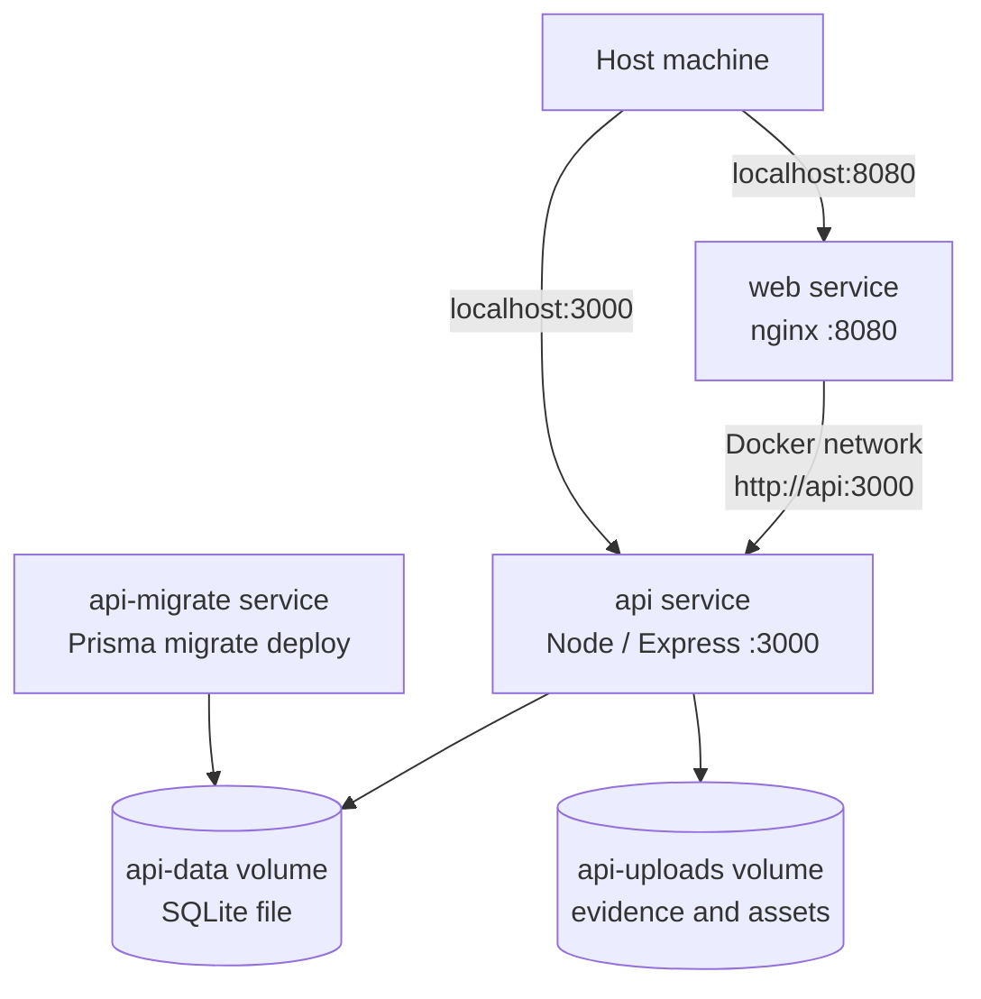

# Docker Compose, Wolumeny, Sieć i Storage

## Cel

Ta notatka opisuje część laba z Docker Compose.

Docker Compose uruchamiał pełny lokalny stack:




```text
api-migrate
api
web
```

Główne obszary nauki:

- kolejność zależności usług,
- host ports vs container ports,
- networking między usługami,
- trwałość SQLite,
- trwałość uploadów,
- runtime validation.

---

## Dockerfile vs Compose

Dockerfile:

```text
Jak zbudować ten obraz?
```

Docker Compose:

```text
Jak uruchomić te usługi razem?
```

W tym labie:

```text
docker/api/Dockerfile
  buduje obraz API

docker/web/Dockerfile
  buduje obraz web

docker-compose.yml
  uruchamia API, web i migracje razem
```

---

## Usługi

### `api-migrate`

Cel:

```text
apply Prisma migrations
przygotuj wolumen bazy SQLite
zakończ się sukcesem
```

To jednorazowy setup job. Nie musi działać cały czas.

### `api`

Cel:

```text
uruchom Node.js / Express API
```

Zależy od poprawnego zakończenia migracji.

### `web`

Cel:

```text
serwuj frontend React/Vite przez nginx
proxy /api i /uploads do API
```

---

## Dlaczego osobna usługa migracji?

Finalny runtime image API powinien skupiać się na uruchomieniu aplikacji.

Migracje są pracą setup/deployment.

Mogą wymagać:

- Prisma CLI,
- plików migracji,
- skryptów,
- narzędzi builda.

Nie zawsze należą do finalnego runtime image.

Lepszy flow:

```text
api-migrate przygotowuje bazę
api uruchamia aplikację
web serwuje frontend
```

```text
Zawężaj odpowiedzialność runtime i pokazuj setup steps jawnie.
```

---

## Kolejność zależności Compose

API używało warunku zależności:

```yaml
depends_on:
  api-migrate:
    condition: service_completed_successfully
```

Znaczenie:

```text
Uruchom API po poprawnym zakończeniu migracji.
```

To ogranicza ryzyko startu API przed istnieniem schematu bazy.

---

## Porty

Format mapowania:

```text
HOST_PORT:CONTAINER_PORT
```

API:

```yaml
ports:
  - "3000:3000"
```

```text
host localhost:3000 -> API container port 3000
```

Web:

```yaml
ports:
  - "8080:8080"
```

```text
host localhost:8080 -> web container port 8080
```

```text
EXPOSE dokumentuje port w Dockerfile.
ports publikuje port na hoście w Compose.
```

```text
Publikuj tylko porty wymagające dostępu z hosta.
```

W surowszej produkcji API mogłoby pozostać wewnętrzne, a publikowany byłby tylko web.

---

## Host networking vs Docker networking

Z hosta:

```text
http://localhost:8080
http://localhost:3000
```

Z jednego kontenera do drugiego:

```text
http://api:3000
```

W kontenerze web `localhost` oznacza sam kontener web.

nginx powinien proxy'ować do:

```text
http://api:3000
```

a nie do:

```text
http://localhost:3000
```

bo API jest w innym kontenerze.

---

## Nazwy usług jako DNS

Docker Compose tworzy domyślną sieć.

Nazwy usług stają się nazwami DNS.

```nginx
proxy_pass http://api:3000/api/;
```

`api` to nazwa usługi.

```text
Ruch wewnętrzny może zostać w sieci Dockera.
Host ports powinny być publikowane intencjonalnie.
```

---

## Trwałość SQLite

SQLite jest bazą plikową.

Nie potrzebuje osobnego kontenera bazy.

Potrzebuje trwałej lokalizacji pliku.

```text
DATABASE_URL=file:/data/appsec-report-builder.db
```

```yaml
volumes:
  - api-data:/data
```

To przechowuje plik SQLite w wolumenie Dockera.

Bez tego usunięcie/odtworzenie kontenera API mogłoby usunąć bazę.

```text
Dla SQLite w Dockerze persistence oznacza trwałość pliku.
```

---

## Trwałość uploadów

Aplikacja zapisuje uploadowane pliki.

Uploady są mutable data.

```yaml
volumes:
  - api-uploads:/app/uploads
```

Po co:

```text
uploady powinny przetrwać odtworzenie kontenera
uploady powinny być oddzielone od warstw obrazu
uploady powinny mieć jawną ścieżkę mutable storage
```

```text
Uploady są niezaufaną treścią. Ważne są storage path, nazewnictwo plików, walidacja i reguły dostępu.
```

---

## Named volumes

Compose definiował:

```yaml
volumes:
  api-data:
  api-uploads:
```

Komendy:

```powershell
docker volume ls
```

albo:

```powershell
docker volume ls | Select-String appsec
```

```powershell
docker compose down
```

usuwa kontenery i sieć, ale zwykle zostawia named volumes.

Niebezpieczne, jeśli chcesz zachować dane:

```powershell
docker compose down -v
```

To usuwa także wolumeny.

---

## Environment variables

Compose przekazywał konfigurację runtime:

```yaml
environment:
  API_PORT: "3000"
  FRONTEND_ORIGIN: http://localhost:8080
  DATABASE_URL: file:/data/appsec-report-builder.db
  NODE_ENV: production
```

```text
Ten sam obraz może działać w różnych środowiskach z różną konfiguracją.
```

```text
Konfiguracja powinna być jawna. Sekrety nie powinny być bake'owane w obrazach.
```

W lokalnym labie te wartości nie były sekretami.

Prawdziwe sekrety powinny używać secret management.

---

## Request flow

Frontend:

```text
http://localhost:8080
```

API przez proxy:

```text
http://localhost:8080/api/health
```

Pełny flow:

```text
Browser
  -> localhost:8080
  -> web nginx container
  -> api:3000
  -> API container
  -> SQLite file in api-data volume
```

---

## Komendy walidacyjne

Start stacka:

```powershell
docker compose up --build -d
```

Sprawdzenie usług:

```powershell
docker compose ps
```

Oczekiwane:

```text
api  Up (healthy)
web  Up
```

Logi migracji:

```powershell
docker compose logs api-migrate
```

Oczekiwane:

```text
All migrations have been successfully applied.
```

API:

```powershell
Invoke-WebRequest http://localhost:3000/api/health -UseBasicParsing
```

Web:

```powershell
Invoke-WebRequest http://localhost:8080 -UseBasicParsing
```

Proxy:

```powershell
Invoke-WebRequest http://localhost:8080/api/health -UseBasicParsing
```

---

## Najważniejszy wniosek

Docker Compose definiuje kształt runtime aplikacji:

```text
które usługi działają
jak startują
jak się komunikują
które porty są wystawione
gdzie dane są trwałe
jaka konfiguracja jest wstrzyknięta
```

Dla AppSec Compose jest częścią granicy bezpieczeństwa.
