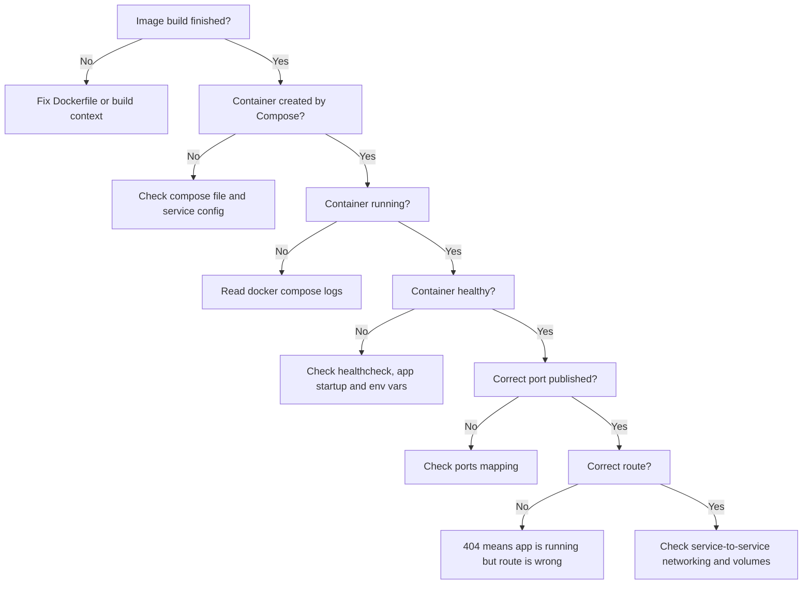

# Debugowanie Runtime Dockera

## Cel

Ta notatka opisuje realne scenariusze debugowania z laba Docker hardening.

Celem jest ćwiczenie poprawnego czytania symptomów zamiast zgadywania.

Problemy z Dockerem warto rozdzielać na kategorie:

```text
Docker daemon problem
image build problem
container startup problem
application runtime problem
networking problem
routing problem
volume/data problem
configuration problem
```

Każda kategoria wymaga innych dowodów.

---

## Podstawowy flow debugowania

Przed zmianą kodu przejdź taki flow:




```text
1. Czy obraz się zbudował?
2. Czy Compose utworzył kontener?
3. Czy kontener działa?
4. Czy jest healthy?
5. Co mówią logi?
6. Czy port jest opublikowany?
7. Czy ścieżka endpointu jest poprawna?
8. Czy aplikacja używa oczekiwanych zmiennych środowiskowych?
9. Czy wolumen jest zamontowany?
10. Czy usługi widzą się po nazwie service?
```

Najbardziej przydatne komendy:

```powershell
docker compose ps
docker compose logs api --tail=80
docker compose logs web --tail=80
docker compose logs api-migrate --tail=80
```

---

## Problem: Docker daemon niedostępny

### Symptom

```text
ERROR: failed to connect to the docker API at npipe:////./pipe/dockerDesktopLinuxEngine
```

### Znaczenie

Docker CLI nie może połączyć się z Docker Desktop Linux Engine.

To nie jest problem Dockerfile.

### Sprawdzenie

```powershell
docker info
```

### Naprawa

Uruchom Docker Desktop.

Jeżeli potrzeba:

```powershell
wsl --shutdown
```

Potem uruchom Docker Desktop ponownie.

### Lekcja

```text
Przed debugowaniem Dockerfile sprawdź, czy Docker Engine działa.
```

---

## Problem: brak pliku podczas builda

### Symptom

Docker build padł podczas kroków związanych z Prisma, bo wymagany skrypt nie był dostępny w build stage.

### Przyczyna

Skrypt istniał lokalnie, ale Docker widzi tylko pliki w build context i te skopiowane do obrazu.

### Naprawa

Skopiuj wymagany skrypt:

```dockerfile
COPY scripts/prisma-command.mjs ./scripts/prisma-command.mjs
```

### Lekcja

```text
Jeżeli komenda builda zależy od pliku, Dockerfile musi go skopiować.
Lokalne pliki nie pojawiają się magicznie w obrazie.
```

---

## Problem: TypeScript build pada w Dockerze

### Symptom

Build doszedł do:

```text
RUN npm run build:server
```

Potem TypeScript zwrócił problemy typowania Prisma/domain.

Przykłady:

```text
Prisma JSON field typing
database string not assignable to domain union
settings date format string not narrowed
readonly orderBy array issue
test JSON value not narrowed
```

### Przyczyna

Docker wymusił czysty production server build.

To ujawniło realne problemy na granicy typów i runtime data.

### Kategorie poprawek

Poprawki wzmacniały aplikację zamiast ukrywać problem:

```text
serializuj HTTP evidence jako plain JSON objects
waliduj stringi z bazy przed mapowaniem do domain unions
narrow unknown JSON przed odczytem właściwości
używaj Prisma-compatible write data
napraw typowanie sortowania raportów
traktuj stored settings jako niezaufane do czasu walidacji
```

### Lekcja

```text
Docker może ujawnić realne problemy jakości builda aplikacji.
Nie obwiniaj automatycznie Dockera, gdy Docker pokazuje problemy TypeScript.
```

```text
Wartości z bazy i pól JSON są runtime data. Waliduj/narrow je przed zaufaniem im jako domain types.
```

---

## Problem: obraz się buduje, API container pada

### Symptom

`docker compose ps` pokazał działający web, ale API nie było uruchomione.

Logi API:

```text
Error [ERR_MODULE_NOT_FOUND]:
Cannot find module '/app/dist-server/generated/prisma/internal/class.ts'
imported from /app/dist-server/generated/prisma/client.js
```

### Błędna pierwsza hipoteza

To mogło wyglądać jak problem kopiowania plików w Dockerze.

Kluczowa wskazówka:

```text
client.js imported class.ts
```

Node uruchamiał JavaScript, ale próbował importować TypeScript.

### Przyczyna

Wygenerowany klient Prisma został skompilowany do JavaScript, ale względne rozszerzenia importów nadal wskazywały `.ts`.

### Naprawa

Dodaj do `tsconfig.server.json`:

```json
{
  "compilerOptions": {
    "rewriteRelativeImportExtensions": true
  }
}
```

### Walidacja

```powershell
Get-ChildItem .\dist-server\generated\prisma -Recurse -Filter *.js |
    Select-String -Pattern "\.ts'"
```

Oczekiwane:

```text
Brak problematycznych importów .ts.
```

### Lekcja

```text
Udany build obrazu nie dowodzi, że wyemitowany JavaScript uruchomi się poprawnie.
Walidacja runtime jest obowiązkowa.
```

---

## Problem: localhost:3000 connection refused

### Symptom

```powershell
Invoke-WebRequest http://localhost:3000/api/health -UseBasicParsing
```

zwróciło:

```text
No connection could be made because the target machine actively refused it.
```

### Znaczenie

Nic nie nasłuchiwało na `localhost:3000`.

Prawdopodobne przyczyny:

```text
API container nie działa
API container padł
API port nie jest opublikowany
API słucha na innym porcie
```

### Sprawdzenie

```powershell
docker compose ps
docker compose logs api --tail=80
```

### Lekcja

```text
Connection refused jest niżej niż routing aplikacji.
Najpierw sprawdź status kontenera, potem ścieżki endpointów.
```

---

## Problem: route not found

### Symptom

```powershell
Invoke-WebRequest http://localhost:3000/health -UseBasicParsing
```

zwróciło:

```json
{
  "error": {
    "code": "NOT_FOUND",
    "message": "API route not found",
    "details": []
  }
}
```

### Znaczenie

API działało, ale ścieżka była błędna.

Poprawny endpoint:

```text
/api/health
```

### Walidacja

```powershell
Invoke-WebRequest http://localhost:3000/api/health -UseBasicParsing
```

Oczekiwane:

```json
{"status":"ok"}
```

### Lekcja

```text
404 oznacza, że aplikacja jest osiągalna, ale route jest błędny.
Connection refused oznacza, że usługa prawdopodobnie nie nasłuchuje.
```

---

## Problem: frontend działa, ale API proxy nie

### Symptom

Frontend zwraca 200, ale requesty API przez origin frontendu nie działają.

Sprawdź frontend:

```powershell
Invoke-WebRequest http://localhost:8080 -UseBasicParsing
```

Sprawdź API bezpośrednio:

```powershell
Invoke-WebRequest http://localhost:3000/api/health -UseBasicParsing
```

Sprawdź API przez nginx:

```powershell
Invoke-WebRequest http://localhost:8080/api/health -UseBasicParsing
```

Jeżeli bezpośrednie API działa, a nginx proxy nie, sprawdź konfigurację nginx.

### Częsta przyczyna

nginx proxy wskazuje na `localhost:3000` zamiast `api:3000`.

W kontenerze web:

```text
localhost = web container
```

Poprawny target:

```text
http://api:3000
```

### Lekcja

```text
W Docker Compose do komunikacji service-to-service używaj nazw usług.
```

---

## Problem: dane znikają po odtworzeniu kontenera

### Symptom

Dane istnieją podczas działania, ale znikają po usunięciu i odtworzeniu kontenerów.

### Przyczyna

Dane były zapisane tylko w filesystemie kontenera.

### Naprawa

Użyj named volumes:

```yaml
volumes:
  - api-data:/data
  - api-uploads:/app/uploads
```

### Lekcja

```text
Kontenery są jednorazowe. Ważne mutable data wymagają wolumenów albo zewnętrznego storage.
```

---

## Problem: wolny production dependency stage

### Symptom

Wolny krok builda:

```bash
npm prune --omit=dev
```

### Przyczyna

Build najpierw instalował wszystkie zależności, a potem usuwał dev dependencies.

### Naprawa

Użyj:

```bash
npm ci --omit=dev --no-audit --no-fund
```

w osobnym production dependency stage.

### Lekcja

```text
Instaluj tylko to, czego runtime potrzebuje, zamiast instalować wszystko i czyścić później.
```

---

## Komendy referencyjne

Kontenery:

```powershell
docker compose ps
```

Logi API:

```powershell
docker compose logs api --tail=80
```

Logi migracji:

```powershell
docker compose logs api-migrate --tail=80
```

Logi web:

```powershell
docker compose logs web --tail=80
```

Rebuild i start:

```powershell
docker compose up --build -d
```

Stop:

```powershell
docker compose down
```

Niebezpieczne, jeśli dane mają zostać:

```powershell
docker compose down -v
```

Wolumeny:

```powershell
docker volume ls
```

---

## Najważniejszy wniosek

Nie zgaduj.

Zacznij od:

```powershell
docker compose ps
docker compose logs api --tail=80
```

Potem testuj requestami HTTP.

Dobry flow debugowania Dockera jest oparty na dowodach:

```text
status
logs
ports
routes
health
volumes
network
```
