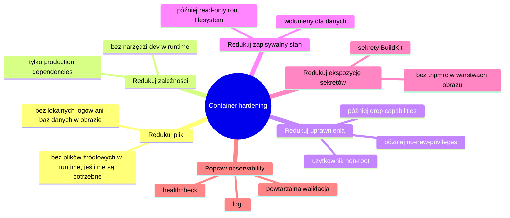

# Checklista Docker Security Hardening

## Cel

Ta notatka zamienia praktyczny lab w checklistę hardeningu kontenerów.

To nie jest pełny production benchmark. To developerska checklista poprawy security posture dla Dockerized Node API, frontendu React i stacka Compose.

Checklista jest podzielona na:

```text
Zastosowane w labie
Do dodania jako następne
Zaawansowane / później
```


---

## Mindset hardeningu

Container hardening to seria redukcji:



```text
redukuj pliki
redukuj zależności
redukuj uprawnienia
redukuj zapisywalne ścieżki
redukuj wystawione porty
redukuj ekspozycję sekretów
redukuj narzędzia runtime
redukuj niejasną konfigurację
redukuj niespodzianki związane z trwałością danych
```

Celem nie jest stworzenie kontenera niemożliwego do złamania.

Celem jest ograniczenie blast radius i przewidywalne zachowanie runtime.

---

## Zastosowane w labie

### 1. Multi-stage builds

```text
API image używał build, production-dependencies i runtime stages.
Web image używał build i nginx runtime stages.
```

Wartość:

```text
build tools nie trafiają automatycznie do runtime
runtime image jest składany z wybranych artefaktów
mniejszy runtime
mniej narzędzi po kompromitacji
czytelny podział build/runtime
```

### 2. Tylko production dependencies w API runtime

```bash
npm ci --omit=dev --no-audit --no-fund
```

Wartość:

```text
mniej pakietów
mniejsza powierzchnia ataku
mniej szumu w vulnerability scans
mniej dev tools w runtime
```

### 3. Frontend runtime bez Node.js

```text
Vite buduje statyczne pliki.
nginx serwuje finalny frontend.
```

Wartość:

```text
brak frontend dev servera w runtime
brak frontend node_modules w runtime
mniejszy i prostszy obraz
```

### 4. nginx unprivileged image

```text
nginxinc/nginx-unprivileged:stable-alpine
```

Wartość:

```text
niższe uprawnienia runtime dla frontendu
lepszy default niż niepotrzebny root runtime
```

### 5. BuildKit secret mount dla npm config

```dockerfile
RUN --mount=type=secret,id=npmrc,target=/root/.npmrc,required=false \
    npm ci --no-audit --no-fund
```

Wartość:

```text
zmniejsza ryzyko wycieku npm tokenów albo private registry config do warstw obrazu
```

### 6. Trwały wolumen SQLite

```yaml
volumes:
  - api-data:/data
```

z:

```text
DATABASE_URL=file:/data/appsec-report-builder.db
```

Wartość:

```text
jawna trwałość danych
mniejsze ryzyko przypadkowej utraty danych
oddzielenie obrazu od mutable data
```

### 7. Trwały wolumen uploadów

```yaml
volumes:
  - api-uploads:/app/uploads
```

Wartość:

```text
jawna granica storage dla uploadowanych plików
```

### 8. Osobna usługa migracji

```text
api-migrate uruchamia migracje i kończy pracę
api uruchamia aplikację
```

Wartość:

```text
czytelny startup flow
węższa odpowiedzialność runtime
widoczna awaria migracji
```

### 9. Healthcheck i runtime validation

```powershell
docker compose ps
docker compose logs api --tail=80
Invoke-WebRequest http://localhost:3000/api/health -UseBasicParsing
Invoke-WebRequest http://localhost:8080/api/health -UseBasicParsing
```

Wartość:

```text
potwierdza runtime behaviour, nie tylko image build
```

---

## Do dodania jako następne

### 1. Non-root API runtime

Cel:

```text
Uruchamiaj proces API jako non-root user.
```

Wzorzec:

```dockerfile
USER node
```

Zadbaj też o ownership:

```dockerfile
COPY --chown=node:node ...
```

```text
Skompromitowany proces aplikacji nie powinien mieć root privileges w kontenerze.
```

### 2. Read-only root filesystem

Cel:

```text
Root filesystem kontenera read-only poza wymaganymi ścieżkami zapisu.
```

Compose idea:

```yaml
read_only: true
tmpfs:
  - /tmp
```

Writable volumes:

```yaml
volumes:
  - api-data:/data
  - api-uploads:/app/uploads
```

### 3. Drop Linux capabilities

Cel:

```text
Usuń niepotrzebne Linux capabilities.
```

```yaml
cap_drop:
  - ALL
```

Dodawaj z powrotem tylko to, co jest wymagane.

### 4. no-new-privileges

Cel:

```text
Uniemożliw procesowi uzyskanie dodatkowych uprawnień.
```

```yaml
security_opt:
  - no-new-privileges:true
```

Pomaga ograniczyć eskalację przez setuid/setgid binaries.

### 5. Resource limits

Cel:

```text
Ogranicz wpływ procesu zużywającego zbyt dużo CPU lub pamięci.
```

To zmniejsza skutki runaway process albo prostych warunków DoS.

### 6. Image vulnerability scanning

Cel:

```text
Skanuj finalne runtime images, nie tylko source dependencies.
```

Narzędzia:

```text
Docker Scout
Trivy
Grype
GitHub Dependabot alerts
```

```text
Skanuj runtime image, bo to jest artefakt wdrożeniowy.
```

### 7. SBOM generation

Cel:

```text
Generuj Software Bill of Materials dla obrazów/zależności.
```

Formaty:

```text
CycloneDX
SPDX
```

```text
SBOM to inventory, nie automatyczny dowód bezpieczeństwa.
```

### 8. Runtime secrets management

Unikaj:

```dockerfile
ENV API_KEY=...
```

Unikaj sekretów w commitowanych plikach Compose:

```yaml
environment:
  DATABASE_PASSWORD: secret
```

Lepsze opcje:

```text
platform secrets
Docker secrets
CI/CD secret injection
secret manager
mounted secret files
```

### 9. Upload security controls

Dla uploadów sprawdź:

```text
file size limits
allowed file types
content validation
randomized storage names
path traversal protection
private storage where possible
safe download headers
malware scanning if required
no execution from upload directories
```

Uploady są niezaufanym inputem zapisanym na dysku.

---

## Zaawansowane / później

### Seccomp

Seccomp filtruje Linux syscalls.

```text
Ogranicz, jakie syscalls może wykonać proces w kontenerze.
```

Zmniejsza kernel attack surface dla skompromitowanego procesu.

### AppArmor

AppArmor może dalej ograniczyć dostęp procesu do plików, capabilities i zachowań.

### Rootless Docker / rootless containers

Cel:

```text
Zmniejsz wpływ problemów z Docker daemon albo uprawnieniami kontenera.
```

### Signed images and provenance

Cel:

```text
Udowodnij, skąd pochodzi obraz i jak został zbudowany.
```

Pojęcia:

```text
image signing
build provenance
SLSA
attestations
```

---

## Praktyczna checklista

### Dockerfile

```text
[ ] Używaj multi-stage builds.
[ ] Kopiuj pliki pakietów przed plikami źródłowymi.
[ ] Używaj npm ci zamiast npm install w buildach.
[ ] Używaj npm ci --omit=dev dla production dependencies.
[ ] Nie kopiuj .npmrc ani sekretów do obrazu.
[ ] Używaj BuildKit secret mounts dla sekretów builda.
[ ] Utrzymuj finalny runtime image wąski i celowy.
[ ] Nie uruchamiaj frontend dev servera w produkcji.
[ ] Używaj non-root runtime user tam, gdzie to praktyczne.
[ ] Ustaw poprawne ownership plików dla non-root runtime.
[ ] Nie dodawaj niepotrzebnych plików source/test/dev.
```

### Compose

```text
[ ] Definiuj usługi jasno.
[ ] Używaj nazw usług dla internal networking.
[ ] Publikuj tylko wymagane host ports.
[ ] Używaj wolumenów dla trwałych mutable data.
[ ] Unikaj sekretów w commitowanych plikach Compose.
[ ] Wydziel migration/setup job, jeśli to pomaga.
[ ] Dodaj health checks.
[ ] Rozważ read_only filesystem.
[ ] Rozważ cap_drop: ALL.
[ ] Rozważ no-new-privileges.
[ ] Dodaj resource limits tam, gdzie są wspierane.
```

### Runtime validation

```text
[ ] docker compose ps pokazuje oczekiwane usługi.
[ ] API ma status Up/healthy.
[ ] Web ma status Up.
[ ] Usługa migracji zakończyła się sukcesem.
[ ] Logi API pokazują poprawny start.
[ ] Web zwraca index.html.
[ ] API health endpoint zwraca 200.
[ ] API działa przez nginx proxy.
[ ] Dane przetrwają odtworzenie kontenera.
[ ] Uploady przetrwają odtworzenie kontenera.
```

---

## Najważniejszy wniosek

Pierwszy krok hardeningu to dyscyplina:

```text
Nie wysyłaj środowiska builda.
Nie wysyłaj sekretów.
Nie wysyłaj dev dependencies.
Nie przechowuj danych w disposable containers.
Nie zgaduj podczas debugowania.
Nie ufaj sukcesowi builda bez runtime validation.
```

Zaawansowane kontrole łatwiej wdrożyć, gdy ten fundament jest czysty.
