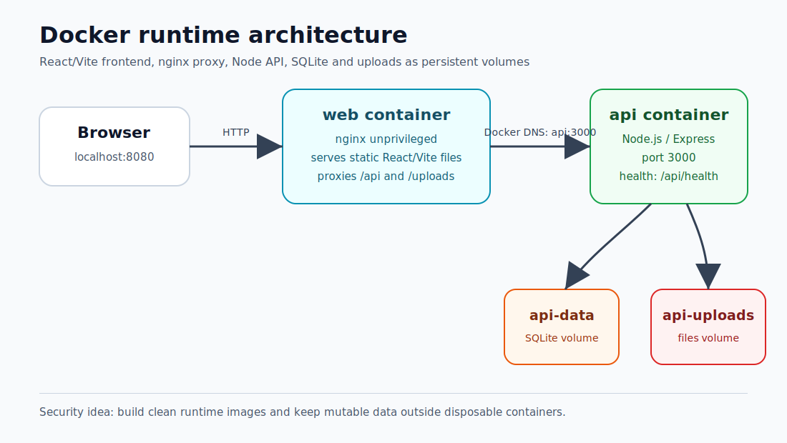
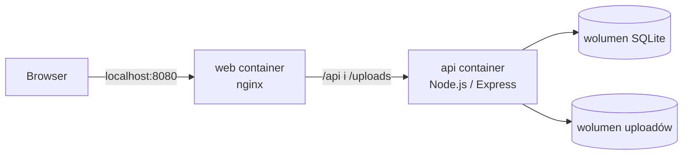

# Lab: Konteneryzacja i Hardening AppSec Report Builder

## Cel

Celem laba była konteneryzacja realnej aplikacji w sposób zbliżony do produkcyjnego oraz nauka praktycznego Docker hardeningu na konkretnych błędach.

Aplikacja nie była małym tutorialem. Miała realny stack:





```text
React / Vite frontend
Node.js / Express API
TypeScript
Prisma
SQLite
lokalne uploady plików
route API
routing frontendu
Dockerfiles
nginx
Docker Compose
```

Lepszy cel niż samo uruchomienie:

```text
buduj czystsze runtime images
oddziel build-time od runtime
nie wysyłaj zbędnych zależności
utrwal lokalne dane poprawnie
debuguj realne awarie kontenerów
rozum wpływ decyzji Dockerowych na bezpieczeństwo
```

---

## Co ten lab zmienił w myśleniu

Docker łatwo traktować jako narzędzie do spakowania i uruchomienia aplikacji.

Po tym labie łatwiej patrzeć na Docker jako kontrakt runtime i granicę bezpieczeństwa.

Obraz Dockera mówi:

```text
te pliki istnieją
te zależności istnieją
ten użytkownik uruchamia proces
ta komenda startuje aplikację
ten port jest oczekiwany
te environment variables mają znaczenie
ta ścieżka danych musi być zapisywalna
```

To jest AppSec-relevant:

- zbyt duży obraz daje zbyt dużo w runtime,
- sekrety skopiowane podczas builda mogą wyciec w warstwach,
- dane zapisane tylko w filesystemie kontenera mogą zniknąć,
- frontend oparty na dev proxy może zawieść w produkcji,
- API działające lokalnie może ujawnić ukryte założenia dopiero w kontenerze.

Największy wniosek:

```text
Docker nie jest tylko o uruchamianiu aplikacji.
Docker definiuje, co aplikacja może mieć w runtime.
```

---

## Kontekst aplikacji

AppSec Report Builder przechowuje i zarządza:

```text
companies
assessments
threats
evidence
reports
settings
uploaded files
```

Backend używa Prisma i SQLite.

Frontend używa React i Vite.

Aplikacja jest local-first, więc SQLite i lokalne uploady są ważne.

W Dockerze oznacza to:

```text
SQLite database musi żyć w wolumenie.
Uploads muszą żyć w wolumenie.
Containers powinny być disposable.
Images nie powinny zawierać runtime data.
```

---

## Finalna architektura

```text
Browser
  |
  v
http://localhost:8080
  |
  v
web container
nginx serwuje statyczne pliki React/Vite
  |
  | /api
  | /uploads
  v
api container
Node.js / Express API na porcie 3000
  |
  v
plik bazy SQLite w wolumenie api-data
```

Usługi:

```text
api-migrate
api
web
```

Wolumeny:

```text
api-data
api-uploads
```

Opublikowane porty:

```text
localhost:8080 -> web container
localhost:3000 -> api container
```

Wewnętrzna sieć Dockera:

```text
web -> api:3000
```

---

## Co zostało zbudowane

### API image

Produkcyjny obraz API używał multi-stage Dockerfile:

```text
build
production-dependencies
runtime
```

Build stage:

```text
npm ci
Prisma client generation
TypeScript server build
```

Production dependency stage:

```text
npm ci --omit=dev
```

Runtime stage:

```text
compiled API
production node_modules
runtime directories
startup command
healthcheck
```

To było lepsze niż wysyłanie pełnego środowiska developerskiego.

### Web image

Produkcyjny obraz web:

```text
Node build stage
nginx runtime stage
```

Build stage:

```text
npm ci
Vite production build
```

Runtime stage:

```text
serve static frontend files with nginx
proxy /api
proxy /uploads
SPA fallback
```

```text
React/Vite potrzebuje Node do builda.
Nie potrzebuje Node do działania w produkcji.
```

### Docker Compose stack

Compose spiął wszystko:

```text
api-migrate przygotowuje bazę
api uruchamia backend
web serwuje frontend i proxy dla ścieżek backendu
```

---

## Komendy builda

API:

```powershell
docker build `
    --file docker/api/Dockerfile `
    --target runtime `
    --tag appsec-report-builder-api:local `
    .
```

Znaczenie:

```text
--file
  wybierz Dockerfile API

--target runtime
  zbuduj finalny runtime stage

--tag
  nazwij obraz

.
  użyj bieżącego katalogu jako build context
```

Web:

```powershell
docker build `
    --file docker/web/Dockerfile `
    --target runtime `
    --tag appsec-report-builder-web:local `
    .
```

Test pojedynczego kontenera web:

```powershell
docker run `
    --rm `
    --name appsec-report-builder-web-test `
    -p 8080:8080 `
    appsec-report-builder-web:local
```

Walidacja:

```powershell
Invoke-WebRequest http://localhost:8080 -UseBasicParsing
```

---

## Uruchomienie Compose

Start:

```powershell
docker compose up --build -d
```

Sprawdzenie:

```powershell
docker compose ps
```

Oczekiwane:

```text
api  Up (healthy)
web  Up
```

Logi API:

```powershell
docker compose logs api --tail=80
```

Logi migracji:

```powershell
docker compose logs api-migrate
```

Oczekiwane:

```text
All migrations have been successfully applied.
```

---

## Finalna walidacja

Frontend:

```powershell
Invoke-WebRequest http://localhost:8080 -UseBasicParsing
```

API direct:

```powershell
Invoke-WebRequest http://localhost:3000/api/health -UseBasicParsing
```

API through nginx proxy:

```powershell
Invoke-WebRequest http://localhost:8080/api/health -UseBasicParsing
```

To potwierdziło:

```text
web container działa
API container działa
nginx proxy działa
sieć Dockera działa
health endpoint działa
stack Compose działa
```

---

## Problem 1: brak skryptu Prisma podczas builda

### Symptom

Build Dockera padł podczas kroków Prisma, bo skrypt wymagany przez package command nie był dostępny w build stage.

### Przyczyna

Skrypt istniał lokalnie, ale nie został skopiowany do obrazu.

### Naprawa

```dockerfile
COPY scripts/prisma-command.mjs ./scripts/prisma-command.mjs
```

### Lekcja

Docker builds są jawne. Plik istniejący lokalnie nie istnieje automatycznie w obrazie.

---

## Problem 2: production build serwera ujawnił błędy TypeScript

### Symptom

API build doszedł do:

```text
RUN npm run build:server
```

Potem TypeScript pokazał problemy Prisma/domain typing:

```text
Prisma JSON field typing
activity action string vs domain union
settings date format string vs allowed values
evidence request/response JSON narrowing
report ordering type mismatch
```

### Przyczyna

Czysty production server build był surowszy niż zwykły development flow.

Ujawnił realne problemy granicy zaufania danych.

### Naprawa

```text
serializuj HTTP evidence jako plain JSON
waliduj stringi z bazy przed mapowaniem do domain types
narrow unknown JSON w testach
używaj Prisma-compatible write data
traktuj settings z storage jako niezaufane do walidacji
napraw typy sortowania repozytorium
```

### Lekcja bezpieczeństwa

To nie był tylko problem TypeScript.

Wartości czytane z bazy albo pola JSON nie powinny automatycznie stawać się zaufanymi obiektami domenowymi.

Bezpieczniejszy wzorzec:

```text
read raw data
validate/narrow it
map to domain type
```

---

## Problem 3: wolny production dependency stage

### Symptom

Wolny krok:

```bash
npm prune --omit=dev
```

### Przyczyna

Build instalował wszystkie dependencies i dopiero później usuwał development dependencies.

### Naprawa

Osobny production dependency stage:

```bash
npm ci --omit=dev --no-audit --no-fund
```

### Lekcja

Lepiej instalować tylko to, czego runtime potrzebuje, niż instalować wszystko i sprzątać później.

---

## Problem 4: obraz API zbudowany, ale kontener pada

### Symptom

Compose pokazywał tylko działający web.

Logi API:

```text
Error [ERR_MODULE_NOT_FOUND]:
Cannot find module '/app/dist-server/generated/prisma/internal/class.ts'
imported from /app/dist-server/generated/prisma/client.js
```

### Przyczyna

Skompilowany JavaScript nadal odwoływał się do importu `.ts` z wygenerowanego klienta Prisma.

Node wykonywał JavaScript i nie mógł zaimportować ścieżki TypeScript.

### Naprawa

Dodaj do `tsconfig.server.json`:

```json
{
  "compilerOptions": {
    "rewriteRelativeImportExtensions": true
  }
}
```

Potem zbuduj ponownie.

### Walidacja

```powershell
Get-ChildItem .\dist-server\generated\prisma -Recurse -Filter *.js |
    Select-String -Pattern "\.ts'"
```

Oczekiwane:

```text
Brak problematycznych importów .ts.
```

### Lekcja

```text
Sukces builda nie oznacza sukcesu runtime.
```

Obraz może zbudować się poprawnie i nadal paść, gdy Node realnie wykona output.

---

## Problem 5: connection refused

### Symptom

```powershell
Invoke-WebRequest http://localhost:3000/api/health -UseBasicParsing
```

zwróciło:

```text
No connection could be made because the target machine actively refused it.
```

### Przyczyna

API container nie działał, bo wcześniej padł.

### Debugging

```powershell
docker compose ps
docker compose logs api --tail=80
```

### Lekcja

Connection refused zwykle oznacza:

```text
no process is listening on that host/port
```

To inna warstwa niż błąd 404.

---

## Problem 6: zła ścieżka health endpoint

### Symptom

```powershell
Invoke-WebRequest http://localhost:3000/health -UseBasicParsing
```

zwróciło:

```json
{
  "error": {
    "code": "NOT_FOUND",
    "message": "API route not found",
    "details": []
  }
}
```

### Przyczyna

API działało, ale ścieżka była zła.

Poprawny endpoint:

```text
/api/health
```

### Lekcja

```text
connection refused:
  container/service nie nasłuchuje

404 route not found:
  app jest osiągalna, path jest błędny

200 OK:
  service i route działają
```

---

## Problem 7: dev proxy frontendu to nie production proxy

### Kontekst

Vite dev server może proxy'ować API requesty w development.

Po buildzie do statycznych plików nie ma już serwera Vite.

### Naprawa

nginx potrzebował jawnych reguł proxy:

```text
/api     -> api:3000
/uploads -> api:3000
```

### Lekcja

Zachowanie development frontendu nie jest zachowaniem produkcyjnym.

Production frontend runtime potrzebuje prawdziwej konfiguracji routing/proxy.

---

## Decyzje bezpieczeństwa zastosowane w labie

```text
multi-stage Docker builds
build stage separated from runtime stage
production dependencies only in API runtime
frontend runtime without Node.js
nginx unprivileged image
BuildKit secret mount for npm config
persistent SQLite volume
persistent uploads volume
separate migration service
explicit runtime environment variables
API healthcheck
runtime validation through logs and HTTP checks
```

To nie są jeszcze zaawansowane kontrole kernel-level, ale są ważnym fundamentem.

---

## Czego lab jeszcze nie pokrywa w pełni

Następne obszary:

```text
read-only root filesystem
tmpfs for temporary writable paths
drop Linux capabilities
no-new-privileges
seccomp profile
AppArmor profile
resource limits
image vulnerability scanning
SBOM generation
runtime secrets management
signed images/provenance
CI/CD image build and scan pipeline
```

Docker hardening jest warstwowy:

```text
czysty image/runtime design
runtime restrictions
supply chain assurance
```

---

## Komendy z laba

Build API:

```powershell
docker build `
    --file docker/api/Dockerfile `
    --target runtime `
    --tag appsec-report-builder-api:local `
    .
```

Build web:

```powershell
docker build `
    --file docker/web/Dockerfile `
    --target runtime `
    --tag appsec-report-builder-web:local `
    .
```

Start stacka:

```powershell
docker compose up --build -d
```

Status usług:

```powershell
docker compose ps
```

Logi API:

```powershell
docker compose logs api --tail=80
```

Logi migracji:

```powershell
docker compose logs api-migrate
```

Frontend:

```powershell
Invoke-WebRequest http://localhost:8080 -UseBasicParsing
```

API direct:

```powershell
Invoke-WebRequest http://localhost:3000/api/health -UseBasicParsing
```

API przez nginx:

```powershell
Invoke-WebRequest http://localhost:8080/api/health -UseBasicParsing
```

Stop stacka:

```powershell
docker compose down
```

Wolumeny:

```powershell
docker volume ls
```

---

## Finalne wnioski

### 1. Docker wymusił czystszy production build

Lokalny development może ukrywać założenia. Docker build i runtime je pokazały.

### 2. Runtime images nie powinny wyglądać jak maszyny developerskie

API runtime powinien uruchamiać skompilowaną aplikację z production dependencies.

Web runtime powinien serwować statyczne pliki, nie Vite dev server.

### 3. Persistent data muszą być jawne

SQLite i uploady potrzebują wolumenów.

Kontenery są disposable.

### 4. Build secrets nie powinny wejść do image layers

Tymczasowe build secret mounts są bezpieczniejsze niż kopiowanie `.npmrc`.

### 5. Logi są obowiązkowe

Najszybsza droga do root cause:

```powershell
docker compose ps
docker compose logs api --tail=80
```

### 6. Różne błędy oznaczają różne warstwy

```text
Docker daemon error:
  Docker engine problem

Build error:
  Dockerfile/build context/app build problem

Connection refused:
  service nie nasłuchuje albo się wysypał

404:
  ścieżka route jest błędna

200:
  route działa
```

### 7. Hardening zaczyna się przed zaawansowanymi kontrolami

Przed seccomp, AppArmor i capabilities trzeba mieć poprawne podstawy:

```text
smaller runtime images
no dev dependencies
no copied secrets
non-dev frontend runtime
persistent volumes
explicit config
runtime validation
```

---

## Refleksja

Ten lab był wartościowy, bo połączył zwykłą pracę developerską z myśleniem AppSec.

Docker wpływał na:

```text
dependency exposure
secret handling
runtime permissions
file persistence
service boundaries
debugging evidence
deployment assumptions
attack surface
```

Praktyczna lekcja:

```text
Bezpieczna konteneryzacja zaczyna się od zrozumienia, czego aplikacja potrzebuje do builda,
czego potrzebuje do działania i czego nie powinna mieć w runtime.
```
