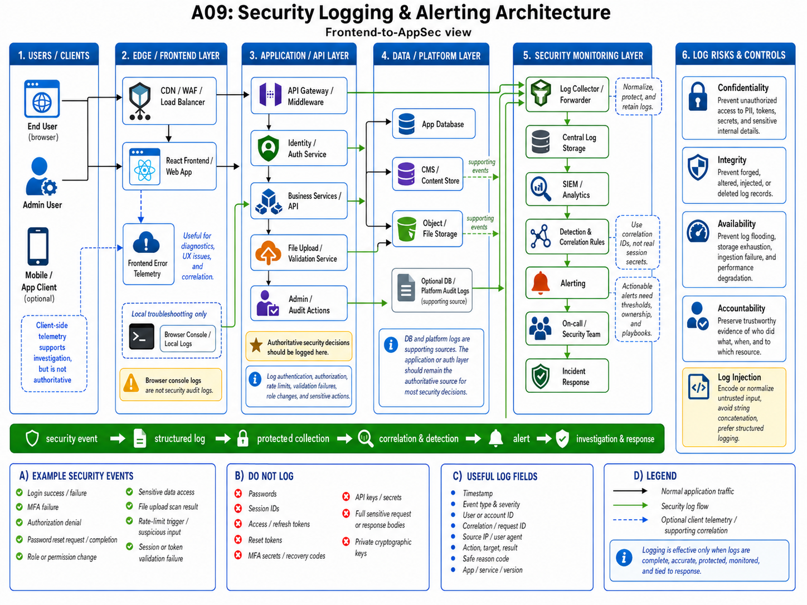

# A09: Security Logging and Alerting Failures

Ten katalog zawiera moje praktyczne notatki do OWASP Top 10 2025 — A09: Security Logging and Alerting Failures.

## Status

**PASS — Frontend Developer przechodzący do AppSec**

Ukończona praca:

- TryHackMe: OWASP Top 10 2025 — sekcja A09 w pokoju IAAA Failures,
- review oficjalnego OWASP A09:2025,
- review OWASP Logging Cheat Sheet,
- review OWASP Logging Vocabulary Cheat Sheet,
- plan logowania i alertowania dla uwierzytelniania,
- code review przykładu podatnego na log injection,
- ćwiczenie klasyfikacji danych w logach,
- przykładowe znalezisko i projekt testów regresji.

Ten status nie oznacza eksperckiej wiedzy z zakresu SOC, SIEM, incident response ani architektury bezpieczeństwa. Oznacza, że potrafię rozpoznać przydatne zdarzenia bezpieczeństwa, wskazać niebezpieczne logowanie, oddzielić logging od monitoringu i alertowania, przejrzeć prosty przepływ detekcji oraz zaproponować kontrole i testy z perspektywy developera/AppSec.

## Główny model mentalny

```text
security event
    -> structured log
    -> protected collection
    -> correlation and detection
    -> alert
    -> investigation and response
```

Log jest dowodem, że zdarzenie zostało zapisane. Nie dowodzi, że zostało wykryte, przejrzane ani że ktoś na nie zareagował.

## Przegląd architektury

[](assets/security-logging-architecture.png)

Grafika rozdziela:

- telemetry z przeglądarki i frontendu,
- autorytatywne eventy aplikacji i warstwy authentication,
- pomocnicze logi bazy danych i platformy,
- collection i chronione storage,
- detection, alerting, ownership oraz response.

Etykiety na grafice pozostają po angielsku, ponieważ odpowiadają nazwom warstw, pól i eventów używanym w kodzie i narzędziach.

## Główne pytania podczas review

1. Jakie zdarzenie istotne dla bezpieczeństwa wystąpiło?
2. Który komponent podjął autorytatywną decyzję bezpieczeństwa?
3. Jakiego kontekstu potrzeba do dochodzenia?
4. Jakie sekrety lub dane wrażliwe trzeba wykluczyć?
5. Czy niezaufany input może zmienić strukturę lub znaczenie logu?
6. Gdzie event jest zbierany i chroniony?
7. Jaka sekwencja albo próg powinny uruchomić detekcję?
8. Kto jest właścicielem alertu?
9. Jaka reakcja powinna nastąpić?
10. Jaki dowód potwierdza, że cały przepływ działa?

## Perspektywa frontendowa

Logi z przeglądarki są przydatne, ale nie są autorytatywnym audytem bezpieczeństwa.

- Użytkownik może zmienić, zablokować lub sfabrykować client-side logs.
- Frontend telemetry może wspierać diagnostykę błędów, performance monitoring i korelację.
- Wyniki authentication i authorization muszą być zapisane tam, gdzie backend je egzekwuje.
- Hasła, session cookies, access tokens, reset tokens, API keys i wrażliwe response bodies nie mogą trafiać do konsoli ani narzędzi telemetrycznych.
- Correlation IDs mogą łączyć eventy frontendu i backendu bez ujawniania rzeczywistych sekretów uwierzytelniających.

## Zacznij tutaj

- [Overview](01-overview.md)
- [Security events i audit logs](02-security-events-and-audit-logs.md)
- [Monitoring, alerting i response](03-monitoring-alerting-and-response.md)
- [Sensitive data i log injection](04-sensitive-data-and-log-injection.md)
- [Frontend i API logging](05-frontend-and-api-logging.md)
- [Checklista review](06-checklist.md)
- [Testy regresji](07-regression-tests.md)
- [Learning notes](08-learning-notes.md)
- [Laby i praktyka](labs-and-practice/README.md)
- [Przykładowe znalezisko](security-findings/01-example-finding-insufficient-security-logging.md)

## Bezpośrednie linki do materiałów

- [OWASP A09:2025 — Security Logging and Alerting Failures](https://owasp.org/Top10/2025/A09_2025-Security_Logging_and_Alerting_Failures/)
- [TryHackMe — OWASP Top 10 2025: IAAA Failures](https://tryhackme.com/room/owasptopten2025one)
- [OWASP Logging Cheat Sheet](https://cheatsheetseries.owasp.org/cheatsheets/Logging_Cheat_Sheet.html)
- [OWASP Logging Vocabulary Cheat Sheet](https://cheatsheetseries.owasp.org/cheatsheets/Logging_Vocabulary_Cheat_Sheet.html)
