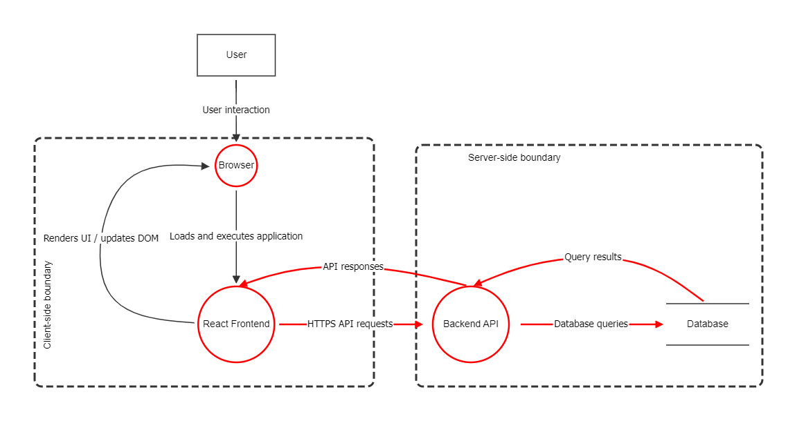

# Simple Web Application Threat Model

Ten mini-projekt modeluje prosta aplikacje webowa przy uzyciu OWASP Threat Dragon i metodyki STRIDE.

Architektura zawiera:

- User
- Browser
- React Frontend
- Backend API
- Database

Model zawiera granice zaufania po stronie klienta i po stronie serwera. Glowne przeplywy danych obejmuja interakcje uzytkownika, wykonanie frontendu, requesty i odpowiedzi HTTPS API, zapytania do bazy danych oraz wyniki zapytan.

## Cel projektu

Celem cwiczenia bylo przećwiczenie identyfikacji potencjalnych zagrozen przed testowaniem realnej implementacji. Model nie potwierdza istnienia zadnej podatnosci. Kazde zagrozenie pozostaje otwarte, bo architektura jest hipotetyczna i nie przeanalizowano kodu zrodlowego, konfiguracji, infrastruktury ani dzialajacej aplikacji.

## Podsumowanie

- Liczba zagrozen: 8
- Otwarte zagrozenia: 8
- Wysoka waznosc: 5
- Srednia waznosc: 3
- Zmitygowane zagrozenia: 0

## Zidentyfikowane zagrozenia

1. Modified API Request
2. Broken Object-Level Authorization
3. Session or Token Theft
4. Excessive Data Returned by API
5. Missing Audit Logging
6. Sensitive Information Exposed in Browser Console
7. Injection in Database Query
8. Sensitive Data Returned from Database

Pelne opisy zagrozen, pomysly na walidacje i mitygacje sa w pliku [threats.md](threats.md).

## Pliki

- `assets/web-application-architecture.png` - wyeksportowany diagram
- `reports/simple-web-application-threat-model.pdf` - raport PDF z Threat Dragon
- `reports/simple-web-application-threat-model.html` - raport HTML z Threat Dragon
- `source/threat-dragon-model.json` - edytowalny model z Threat Dragon
- `stride-cheat-sheet.md` - krotka sciaga STRIDE
- `debrief.md` - refleksja z cwiczenia i ograniczenia
- `threats.md` - uporzadkowany rejestr zagrozen

## Status

To hipotetyczny model edukacyjny. Zagrozenia nie zostaly zwalidowane na realnej implementacji.
